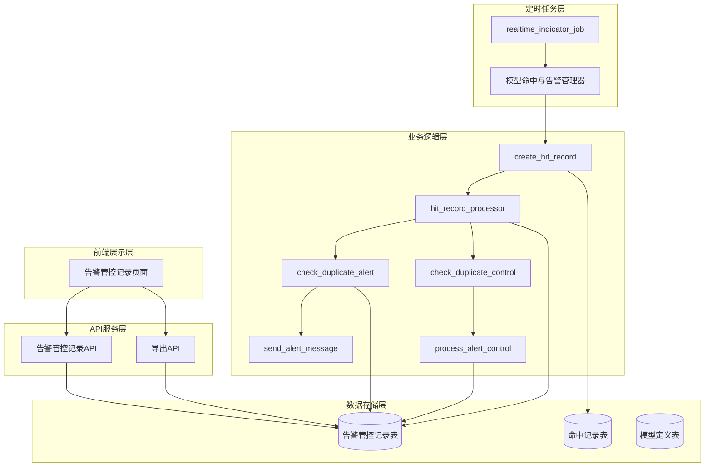
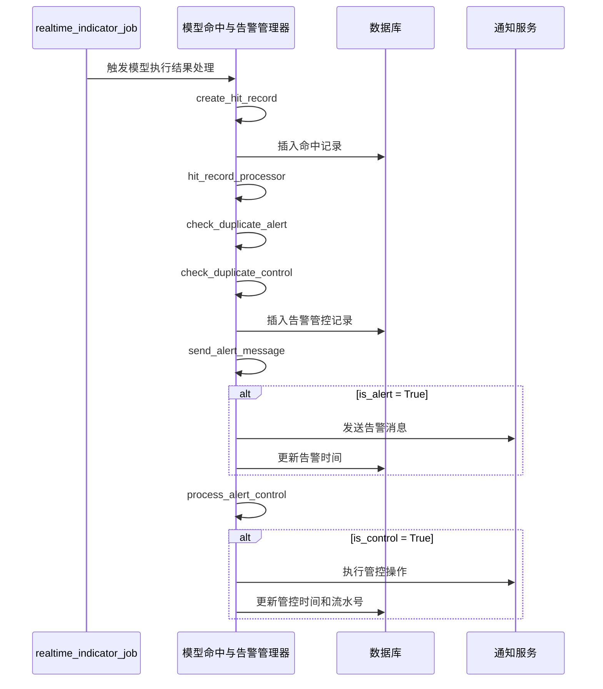

# 模型执行跟踪系统设计文档

## 概述

模型执行跟踪系统是FraudHunter平台的核心组件，负责记录风控模型的运行结果、处理告警与管控逻辑，并提供完整的查询和分析功能。系统采用事件驱动架构，通过定时任务触发模型执行，自动处理命中记录的生成和告警管控的执行。

## 架构

### 系统架构图



### 数据流架构



## 组件和接口

### 核心组件

#### 模型命中与告警管理器 (ModelHitAlertManager)

```python
class ModelHitAlertManager:
    def create_hit_record(self, account_id: str, hit_models: List[ModelHit], 
                         indicator_data: Dict[str, Any], hit_time: datetime) -> HitRecord
    
    def hit_record_processor(self, hit_record: HitRecord) -> List[AlertControlRecord]
    
    def check_duplicate_alert(self, account_id: str, model_ids: List[int], date: date) -> Dict[int, bool]
    
    def check_duplicate_control(self, account_id: str, date: date) -> bool
    
    def send_alert_message(self, alert_records: List[AlertControlRecord]) -> None
    
    def process_alert_control(self, alert_records: List[AlertControlRecord]) -> None
    
    def get_alert_control_records(self, filters: AlertControlFilters) -> List[AlertControlRecord]
    
    def export_alert_control_records(self, filters: AlertControlFilters, format: str) -> bytes
```

### API接口设计

#### 告警管控记录API

```python
# GET /api/fraudhunter/alert-control-records
# 查询告警管控记录列表
def list_alert_control_records(page: int, page_size: int, filters: AlertControlFilters) -> AlertControlListResponse

# GET /api/fraudhunter/alert-control-records/{record_id}
# 获取告警管控记录详情
def get_alert_control_record(record_id: int) -> AlertControlRecordResponse

# POST /api/fraudhunter/alert-control-records/export
# 导出告警管控记录
def export_alert_control_records(filters: AlertControlFilters, format: str) -> FileResponse
```

## 数据模型

### 命中记录表 (fraudhunter_hit_record)

```sql
CREATE TABLE fraudhunter_hit_record (
    id BIGINT PRIMARY KEY AUTO_INCREMENT COMMENT '主键ID',
    account_id VARCHAR(64) NOT NULL COMMENT '账号标识',
    hit_time DATETIME NOT NULL COMMENT '命中时间',
    hit_model_ids JSON NOT NULL COMMENT '命中模型ID列表',
    hit_model_names JSON NOT NULL COMMENT '命中模型名称列表',
    indicator_data JSON NOT NULL COMMENT '指标数据',
    created_at DATETIME DEFAULT CURRENT_TIMESTAMP COMMENT '创建时间',
    updated_at DATETIME DEFAULT CURRENT_TIMESTAMP ON UPDATE CURRENT_TIMESTAMP COMMENT '更新时间',
    
    INDEX idx_account_id (account_id),
    INDEX idx_hit_time (hit_time),
    INDEX idx_created_at (created_at)
) COMMENT='模型运行命中记录表';
```

### 告警管控记录表 (fraudhunter_alert_control_record)

```sql
CREATE TABLE fraudhunter_alert_control_record (
    id BIGINT PRIMARY KEY AUTO_INCREMENT COMMENT '主键ID',
    hit_record_id BIGINT NOT NULL COMMENT '命中记录ID',
    account_id VARCHAR(64) NOT NULL COMMENT '账号标识',
    record_date DATE NOT NULL COMMENT '记录日期',
    model_id INT NOT NULL COMMENT '模型ID',
    model_name VARCHAR(128) NOT NULL COMMENT '模型名称',
    
    -- 告警相关字段
    alert_status VARCHAR(16) DEFAULT 'not_configured' COMMENT '告警状态：not_configured/sent/duplicate',
    alert_message TEXT COMMENT '告警消息内容',
    alert_person VARCHAR(64) COMMENT '告警人',
    alert_time DATETIME COMMENT '告警时间',
    
    -- 管控相关字段
    control_status VARCHAR(16) DEFAULT 'not_configured' COMMENT '管控状态：not_configured/executed/duplicate',
    control_time DATETIME COMMENT '管控时间',
    control_serial_number VARCHAR(64) COMMENT '管控流水号',
    
    created_at DATETIME DEFAULT CURRENT_TIMESTAMP COMMENT '创建时间',
    updated_at DATETIME DEFAULT CURRENT_TIMESTAMP ON UPDATE CURRENT_TIMESTAMP COMMENT '更新时间',
    
    FOREIGN KEY (hit_record_id) REFERENCES fraudhunter_hit_record(id) ON DELETE CASCADE,
    INDEX idx_account_date (account_id, record_date),
    INDEX idx_model_id (model_id),
    INDEX idx_alert_time (alert_time),
    INDEX idx_control_time (control_time),
    INDEX idx_hit_record_id (hit_record_id)
) COMMENT='模型告警与管控记录表';
```

### 数据模型类

```python
class HitRecord(Base):
    __tablename__ = "fraudhunter_hit_record"
    
    id = Column(BigInteger, primary_key=True, autoincrement=True)
    account_id = Column(String(64), nullable=False)
    hit_time = Column(DateTime, nullable=False)
    hit_model_ids = Column(JSON, nullable=False)
    hit_model_names = Column(JSON, nullable=False)
    indicator_data = Column(JSON, nullable=False)
    created_at = Column(DateTime, default=datetime.now)
    updated_at = Column(DateTime, default=datetime.now, onupdate=datetime.now)

class AlertControlRecord(Base):
    __tablename__ = "fraudhunter_alert_control_record"
    
    id = Column(BigInteger, primary_key=True, autoincrement=True)
    hit_record_id = Column(BigInteger, ForeignKey('fraudhunter_hit_record.id'), nullable=False)
    account_id = Column(String(64), nullable=False)
    record_date = Column(Date, nullable=False)
    model_id = Column(Integer, nullable=False)
    model_name = Column(String(128), nullable=False)
    
    # 告警字段
    alert_status = Column(String(16), default='not_configured')  # not_configured/sent/duplicate
    alert_message = Column(Text)
    alert_person = Column(String(64))
    alert_time = Column(DateTime)
    
    # 管控字段
    control_status = Column(String(16), default='not_configured')  # not_configured/executed/duplicate
    control_time = Column(DateTime)
    control_serial_number = Column(String(64))
    
    created_at = Column(DateTime, default=datetime.now)
    updated_at = Column(DateTime, default=datetime.now, onupdate=datetime.now)
```

## 正确性属性

*属性是一个特征或行为，应该在系统的所有有效执行中保持为真——本质上，是关于系统应该做什么的正式声明。属性作为人类可读规范和机器可验证正确性保证之间的桥梁。*

### 属性 1: 命中记录创建完整性
*对于任何*模型执行结果，当账号命中模型时，系统应当创建包含所有必需字段（账号标识、指标数据、命中模型信息、命中时间）的命中记录
**验证需求: 1.1, 1.4**

### 属性 2: 多模型命中存储一致性
*对于任何*账号同时命中多个模型的情况，系统应当在单条记录中正确存储所有命中模型的ID和名称列表
**验证需求: 1.2**

### 属性 3: 重复命中记录独立性
*对于任何*账号在同一天多次命中相同模型的情况，系统应当为每次命中创建独立的记录，记录数量等于命中次数
**验证需求: 1.3**

### 属性 4: 指标数据序列化一致性
*对于任何*指标数据，序列化为JSON后再反序列化应当得到等价的数据结构
**验证需求: 1.5**

### 属性 5: 告警管控记录关联性
*对于任何*命中记录，系统应当自动生成对应的告警管控记录，且两者通过外键正确关联
**验证需求: 2.1, 5.2**

### 属性 6: 告警消息格式一致性
*对于任何*首次命中告警模型的账号，生成的告警消息应当符合"账户 {账号} 在 {时间}，因命中{模型列表}模型，触发告警"的格式
**验证需求: 2.2**

### 属性 7: 告警状态设置正确性
*对于任何*告警处理，系统应当根据模型配置和历史记录正确设置alert_status：未配置告警的模型为'not_configured'，首次告警为'sent'，重复告警为'duplicate'
**验证需求: 2.3**

### 属性 8: 管控消息格式一致性
*对于任何*首次命中管控模型的账号，生成的告警消息应当符合"账户 {账号} 在 {时间}，因命中{模型列表}模型，触发告警及管控"的格式
**验证需求: 2.4**

### 属性 9: 管控状态设置正确性
*对于任何*管控处理，系统应当根据模型配置和历史记录正确设置control_status：未配置管控的模型为'not_configured'，首次管控为'executed'，重复管控为'duplicate'
**验证需求: 2.5**

### 属性 10: 查询筛选结果正确性
*对于任何*筛选条件（日期范围、账号、模型），查询结果应当只包含满足所有筛选条件的记录
**验证需求: 3.2, 4.2**

### 属性 11: 记录详情数据完整性
*对于任何*命中记录或告警管控记录，详情查询应当返回该记录的所有字段信息
**验证需求: 3.3, 4.3, 4.4**

### 属性 12: 数据导出内容一致性
*对于任何*导出请求，导出的数据内容应当与查询结果保持一致
**验证需求: 3.4**

### 属性 13: 分页逻辑正确性
*对于任何*分页参数，返回的记录数量应当不超过页面大小，且总记录数应当等于所有页面记录数之和
**验证需求: 3.5**

### 属性 14: 统计数据计算准确性
*对于任何*日期范围，统计结果应当等于该范围内实际记录的聚合计算结果
**验证需求: 4.5**

### 属性 15: 并发操作数据一致性
*对于任何*并发的命中记录创建操作，最终的数据状态应当反映所有操作的正确执行，不存在数据丢失或重复
**验证需求: 5.4**

## 错误处理

### 异常处理

系统将使用标准的Python异常处理机制，直接抛出包含具体错误原因的异常信息：

```python
# 数据库操作异常
raise ValueError("命中记录创建失败：账号ID不能为空")

# 业务逻辑异常  
raise ValueError("告警处理失败：模型ID不存在")

# 数据导出异常
raise ValueError("数据导出失败：不支持的文件格式")
```

### 错误处理策略

1. **数据库连接异常**: 实现重试机制，最多重试3次
2. **JSON序列化异常**: 记录错误日志，返回格式化错误信息
3. **外部服务调用异常**: 实现熔断机制，避免级联故障
4. **并发冲突异常**: 使用乐观锁机制，自动重试冲突操作
5. **数据验证异常**: 返回详细的验证错误信息，便于问题定位

## 前端设计

### 页面结构

#### 告警管控记录页面 (/fraudhunter/alert-control-records)

**页面功能:**
- 查看告警管控记录列表
- 支持多条件筛选和搜索
- 查看记录详情
- 导出记录数据

**页面布局:**

```
┌─────────────────────────────────────────────────────────────┐
│                    告警管控记录管理                          │
├─────────────────────────────────────────────────────────────┤
│ 筛选条件:                                                   │
│ [日期范围选择器] [账号输入框] [模型选择器] [状态选择器] [搜索] │
├─────────────────────────────────────────────────────────────┤
│ 操作: [导出Excel] [导出CSV]                                 │
├─────────────────────────────────────────────────────────────┤
│ 记录列表:                                                   │
│ ┌─────┬──────┬──────┬──────┬──────┬──────┬──────┬──────┐    │
│ │ID   │账号  │日期  │模型  │告警  │管控  │时间  │操作  │    │
│ ├─────┼──────┼──────┼──────┼──────┼──────┼──────┼──────┤    │
│ │001  │A001  │12-12 │模型A │是    │否    │10:30 │详情  │    │
│ │002  │A002  │12-12 │模型B │是    │是    │11:15 │详情  │    │
│ └─────┴──────┴──────┴──────┴──────┴──────┴──────┴──────┘    │
├─────────────────────────────────────────────────────────────┤
│ 分页: [上一页] 1 2 3 ... 10 [下一页] 共100条                │
└─────────────────────────────────────────────────────────────┘
```

### 组件设计

#### 1. 筛选组件 (AlertControlRecordFilters)

```typescript
interface AlertControlRecordFilters {
  dateRange?: [string, string];     // 日期范围
  accountId?: string;               // 账号ID
  modelId?: number;                 // 模型ID
  alertStatus?: string;             // 告警状态：not_configured/sent/duplicate
  controlStatus?: string;           // 管控状态：not_configured/executed/duplicate
  search?: string;                  // 搜索关键词
}
```

#### 2. 记录列表组件 (AlertControlRecordTable)

**列定义:**
- ID: 记录唯一标识
- 账号: 命中账号
- 日期: 记录日期
- 模型: 命中模型名称
- 告警状态: 显示状态标签（未配置/已发送/重复）
- 管控状态: 显示状态标签（未配置/已执行/重复）
- 时间: 命中时间
- 操作: 查看详情按钮

**状态显示规则:**
- not_configured: 灰色标签 "未配置"
- sent/executed: 绿色标签 "已发送"/"已执行"
- duplicate: 橙色标签 "重复告警"/"重复管控"

#### 3. 详情弹窗组件 (AlertControlRecordDetail)

**详情内容:**
```
基本信息:
- 记录ID: 001
- 账号: A001
- 命中时间: 2024-12-12 10:30:15
- 记录日期: 2024-12-12

模型信息:
- 模型ID: 123
- 模型名称: 高风险交易模型

告警信息:
- 告警状态: 已发送
- 告警消息: 账户 A001 在 2024-12-12 10:30:15，因命中高风险交易模型，触发告警
- 告警人: system
- 告警时间: 2024-12-12 10:30:20

管控信息:
- 管控状态: 未配置
- 管控时间: -
- 管控流水号: -

关联命中记录:
- 命中记录ID: 456
- 指标数据: [JSON展示]
```

#### 4. 导出功能组件 (ExportButton)

**支持格式:**
- Excel (.xlsx)
- CSV (.csv)

**导出内容:**
- 根据当前筛选条件导出
- 包含所有字段信息
- 支持大数据量分批导出

### 路由配置

```typescript
// 告警管控记录页面路由
{
  path: '/fraudhunter/alert-control-records',
  component: AlertControlRecordsPage,
  meta: {
    title: '告警管控记录',
    requiresAuth: true
  }
}
```

### 状态管理

```typescript
interface AlertControlRecordState {
  records: AlertControlRecord[];
  total: number;
  loading: boolean;
  filters: AlertControlRecordFilters;
  pagination: {
    page: number;
    pageSize: number;
  };
  selectedRecord?: AlertControlRecord;
  showDetail: boolean;
}
```

## 测试策略

### 单元测试

单元测试将覆盖以下核心组件：
- 命中记录处理器的各个方法
- 告警管控处理器的业务逻辑
- 去重逻辑引擎的算法实现
- 数据模型的序列化和反序列化
- API路由的请求响应处理

### 属性基础测试

系统将使用**Hypothesis**作为属性基础测试库，每个属性测试将运行最少100次迭代以确保充分的随机性覆盖。

属性测试将验证以下方面：
- 命中记录创建的数据完整性和一致性
- 告警管控逻辑的正确性和去重机制
- 查询和筛选功能的结果准确性
- 数据导出和统计计算的正确性
- 并发操作下的数据一致性

每个属性测试必须使用以下格式的注释标记：
```python
# **Feature: model-execution-tracking, Property {number}: {property_text}**
```

### 集成测试

集成测试将验证：
- 定时任务触发到记录创建的完整流程
- API接口与数据库的交互
- 前端页面与后端API的集成
- 外部通知服务的调用

### 性能测试

性能测试将关注：
- 大量命中记录的创建性能
- 复杂查询条件下的响应时间
- 数据导出的处理速度
- 并发访问下的系统稳定性