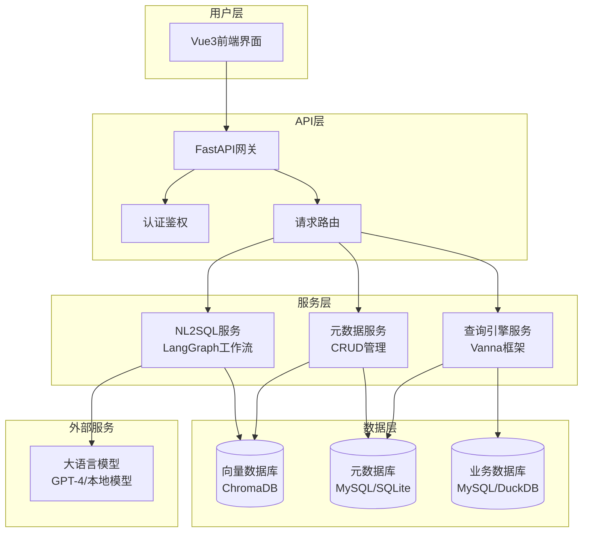
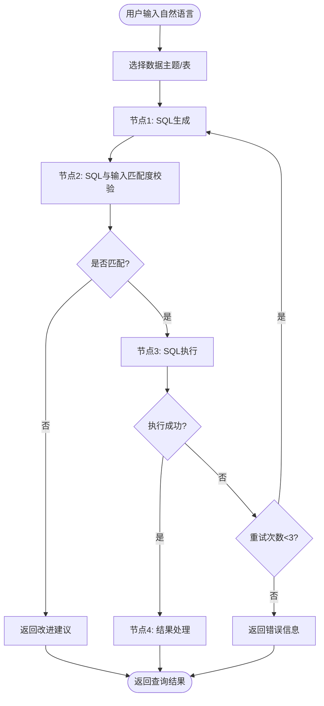
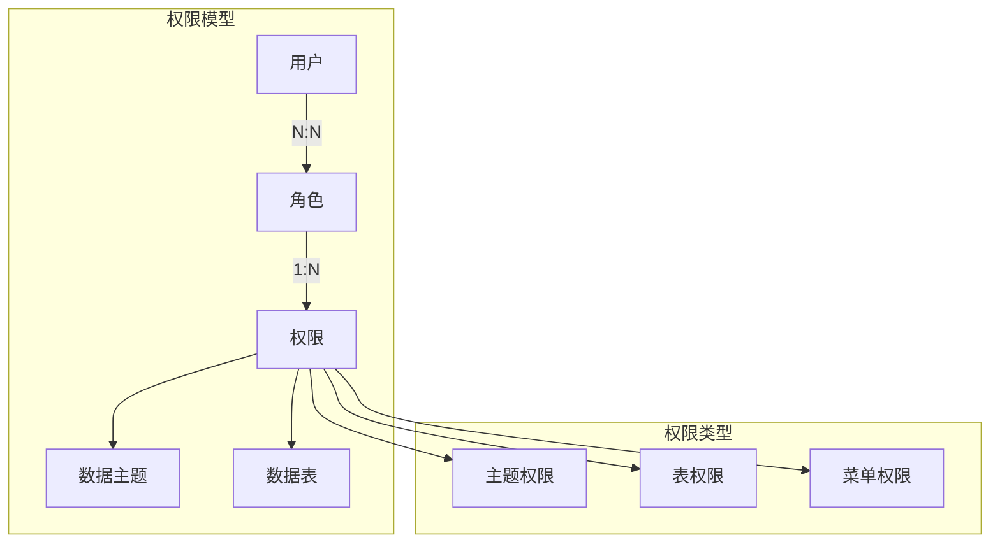
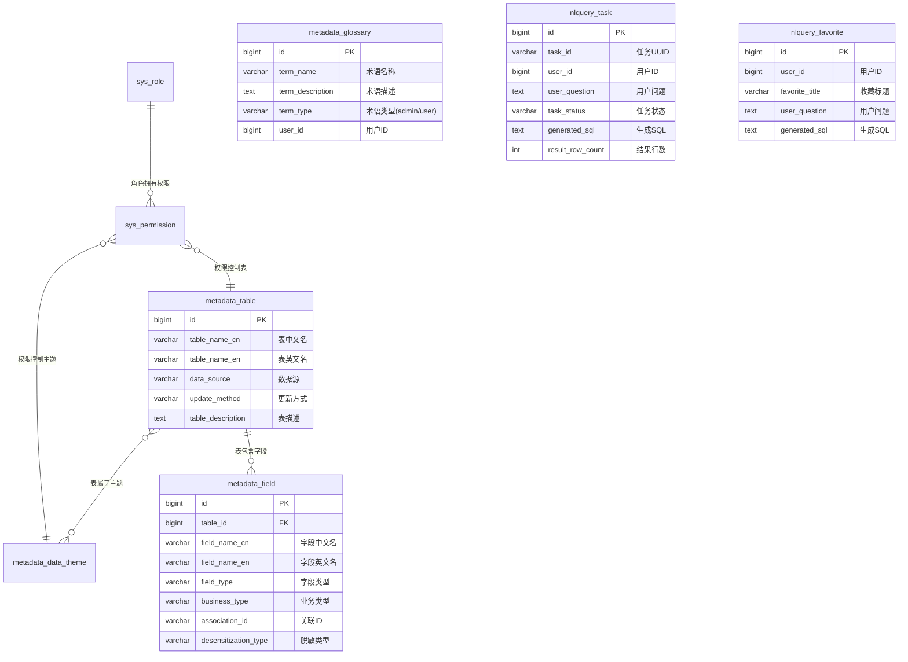

# 淘沙分析平台系统设计文档

## 1. 项目概述

### 1.1 项目定位
淘沙分析平台是一个面向非技术人员的企业内部数据分析平台，核心功能是将自然语言查询转换为SQL并执行，让业务人员无需学习SQL即可获取数据。

### 1.2 技术架构类型
该项目属于**全栈应用**，包含前端用户界面和后端API服务，采用前后端分离架构。

### 1.3 核心价值
- 降低数据查询门槛，提升数据获取效率
- 构建企业数据知识库，沉淀业务术语和数据关系
- 减少数据团队重复性查询工作量

## 2. 系统架构设计

### 2.1 整体架构



### 2.2 核心查询流程

#### 流程2：SQL生成优先（默认流程）



### 2.3 权限控制架构



## 3. 开发任务拆解

### 3.1 MVP阶段任务

#### 阶段1：基础框架搭建（优先级：P0）

**后端基础设施**
- 项目目录结构初始化
- FastAPI框架搭建，配置CORS和中间件
- 数据库连接工具类（支持SQLite/MySQL切换）
- 日志系统配置（loguru）
- 配置管理系统（YAML配置文件）
- 基础认证中间件（base64解码认证信息）

**前端基础设施**
- Vue3 + TypeScript + Vite项目初始化
- DaisyUI + Tailwind CSS配置
- Axios HTTP客户端封装
- Pinia状态管理配置
- 路由配置
- 主题切换功能

#### 阶段2：元数据管理核心功能（优先级：P0）

**数据库表设计与初始化**
- 设计并创建元数据相关表结构
- 编写SQLite和MySQL建表SQL脚本
- 实现数据库初始化脚本

**元数据CRUD接口**
- 表元数据管理接口（增删改查）
- 字段元数据管理接口
- 术语表管理接口
- 数据主题管理接口
- 权限控制管理接口

**元数据管理前端页面**
- 表配置页面
- 字段配置页面
- 术语管理页面
- 数据主题配置页面

#### 阶段3：NL2SQL核心引擎（优先级：P0）

**LangGraph工作流引擎**
- 设计LangGraph工作流状态结构
- 实现SQL生成节点
- 实现SQL执行节点
- 实现工作流编排和状态管理

**Vanna框架集成**
- Vanna框架基础配置
- ChromaDB向量数据库集成
- 权限控制的Vanna封装类
- 知识库训练和更新机制

**查询引擎实现**
- 抽象查询引擎基类
- DuckDB查询引擎（测试环境）
- MySQL查询引擎（生产环境）
- SQL执行结果处理

#### 阶段4：查询功能实现（优先级：P0）

**查询API接口**
- 查询任务提交接口
- 查询进度获取接口
- 查询结果获取接口
- 查询任务取消接口

**查询前端界面**
- 主查询页面布局
- 查询框组件（数据主题/表选择）
- 进度查看器组件
- 结果展示组件（表格+基础图表）

**实时通信**
- WebSocket连接实现
- 查询进度实时推送
- 前端进度状态更新

#### 阶段5：基础数据管理（优先级：P1）

**查询历史功能**
- 查询历史记录存储
- 历史查询接口
- 历史记录前端展示
- 查询重新执行功能

**用户权限基础**
- 角色权限模型实现
- 基础权限校验中间件
- 用户权限接口
- 前端权限控制

### 3.2 完整功能阶段任务

#### 阶段6：高级查询功能（优先级：P1）

**查询收藏功能**
- 收藏查询接口
- 收藏管理（增删改查）
- 收藏查询执行
- 收藏夹前端页面

**查询反馈系统**
- 反馈提交接口
- 反馈管理（管理员查看）
- 反馈统计分析
- 前端反馈组件

**查询结果导出**
- Excel导出功能
- CSV导出功能
- 导出权限控制
- 导出任务管理

#### 阶段7：元数据高级功能（优先级：P2）

**关联元数据管理**
- 表关联关系配置
- 关联元数据CRUD接口
- 关联关系可视化
- JOIN查询支持

**知识库自动同步**
- 元数据变更检测
- 定时同步任务
- 知识库增量更新
- 同步状态监控

**提示词模板管理**
- 模板CRUD接口
- 模板变量校验
- 模板版本管理
- 不同节点模板配置

#### 阶段8：系统管理功能（优先级：P2）

**用户管理**
- 用户CRUD接口
- 角色分配管理
- 用户权限查看
- 用户管理前端页面

**日志管理系统**
- 查询日志详细记录
- 日志查询和筛选接口
- 日志统计分析
- 日志管理前端页面

**系统配置管理**
- 系统配置CRUD接口
- LLM配置管理
- 数据库配置管理
- 配置热更新

#### 阶段9：性能优化与监控（优先级：P3）

**查询性能优化**
- 查询结果缓存
- 相似查询推荐
- SQL执行优化
- 大结果集分页

**系统监控**
- 查询性能监控
- 系统资源监控
- 错误率统计
- 用户行为分析

**安全加固**
- SQL注入防护加强
- 数据脱敏实现
- 审计日志完善
- 安全策略配置

## 4. 数据模型设计

### 4.1 核心实体关系



### 4.2 权限控制模型

**多角色权限交集机制**：
- 用户可拥有多个角色
- 每个角色有独立的权限列表
- 用户实际权限 = 所有角色权限的交集
- 权限包括：数据主题权限、数据表权限、菜单权限

**数据访问控制**：
- 公共主题：所有用户都可访问
- 用户查询范围 = 选择主题的表 + 公共主题的表
- Vanna框架中实现权限过滤，只返回用户有权限的元数据

## 5. 技术实现规范

### 5.1 后端技术栈

| 技术组件 | 选型 | 用途 |
|---------|------|------|
| 编程语言 | Python 3.11+ | 主要开发语言 |
| Web框架 | FastAPI | 高性能异步API框架 |
| 工作流引擎 | LangGraph | LLM应用工作流编排 |
| NL2SQL框架 | Vanna | NL2SQL基础能力 |
| 向量数据库 | ChromaDB | 轻量级向量存储 |
| 关系数据库 | SQLite/MySQL | 元数据存储 |
| 查询引擎 | DuckDB/MySQL | 业务数据查询 |
| ORM | SQLAlchemy | 数据库操作 |
| 日志 | Loguru | 日志管理 |

### 5.2 前端技术栈

| 技术组件 | 选型 | 用途 |
|---------|------|------|
| 编程语言 | TypeScript | 类型安全开发 |
| 框架 | Vue 3 | 前端界面框架 |
| 构建工具 | Vite | 快速构建和热更新 |
| UI组件库 | DaisyUI | Tailwind CSS组件 |
| 状态管理 | Pinia | Vue状态管理 |
| HTTP客户端 | Axios | API请求 |
| 图表库 | ECharts | 数据可视化 |
| WebSocket | socket.io-client | 实时通信 |

### 5.3 项目目录结构

**后端目录结构**：
```
backend/
├── api/                    # API接口层
├── config/                 # 配置文件
├── database/               # 测试数据库文件
├── models/                 # 数据模型
├── schemas/                # Pydantic Schema
├── services/               # 服务层
│   ├── query_engine/       # 查询引擎
│   ├── metadata_service/   # 元数据服务
│   └── nl2sql_service/     # NL2SQL服务
├── utils/                  # 工具类
└── main.py                 # 应用入口
```

**前端目录结构**：
```
frontend/
├── src/
│   ├── components/         # 通用组件
│   ├── views/              # 页面视图
│   ├── stores/             # 状态管理
│   ├── api/                # API调用
│   ├── router/             # 路由配置
│   └── utils/              # 工具函数
```

## 6. API接口设计

### 6.1 接口规范

**统一响应格式**：
```json
{
  "code": 0,
  "message": "success",
  "data": {},
  "timestamp": 1234567890
}
```

**认证方式**：
- 测试环境：base64编码的header认证
- 生产环境：预留外部认证接口

### 6.2 核心接口列表

**查询相关接口**：
```
POST /api/taosha/v1/nlquery/submit        # 提交查询
GET  /api/taosha/v1/nlquery/progress/{id} # 查询进度
GET  /api/taosha/v1/nlquery/result/{id}   # 查询结果
POST /api/taosha/v1/nlquery/cancel/{id}   # 取消查询
GET  /api/taosha/v1/nlquery/history       # 查询历史
```

**元数据管理接口**：
```
GET  /api/taosha/v1/metadata/tables       # 表列表
POST /api/taosha/v1/metadata/tables       # 新增表
GET  /api/taosha/v1/metadata/fields       # 字段列表
POST /api/taosha/v1/metadata/fields       # 新增字段
GET  /api/taosha/v1/metadata/themes       # 主题列表
POST /api/taosha/v1/metadata/themes       # 新增主题
```

**收藏和反馈接口**：
```
POST /api/taosha/v1/nlquery/favorite      # 添加收藏
GET  /api/taosha/v1/nlquery/favorite      # 收藏列表
POST /api/taosha/v1/nlquery/feedback      # 提交反馈
```

### 6.3 WebSocket接口

**实时进度推送**：
```
WS /ws/nlquery/progress/{task_id}
```

## 7. 部署与环境配置

### 7.1 开发环境配置

**后端环境**：
```yaml
# config/config.dev.yaml
database:
  type: sqlite
  path: database/metadata.db

query_engine:
  type: duckdb
  path: database/business.duckdb

llm:
  provider: openai
  base_url: ${LLM_BASE_URL}
  api_key: ${LLM_API_KEY}
  model: gpt-4-turbo
```

**前端环境**：
```bash
# .env.development
VITE_API_BASE_URL=http://localhost:8000
VITE_WS_BASE_URL=ws://localhost:8000
```

### 7.2 生产环境配置

**后端配置**：
```yaml
# config/config.prod.yaml
database:
  type: mysql
  host: ${DB_HOST}
  port: 3306
  database: taosha_metadata
  
query_engine:
  type: mysql
  host: ${BUSINESS_DB_HOST}
  port: 3306
  database: business_data
```

## 8. 测试策略

### 8.1 测试覆盖范围

| 测试类型 | 覆盖率要求 | 重点测试内容 |
|---------|-----------|-------------|
| 单元测试 | >80% | API接口、服务层方法 |
| 集成测试 | 核心流程 | NL2SQL工作流、元数据同步 |
| 端到端测试 | 主要用户路径 | 查询流程、管理功能 |

### 8.2 测试工具

- **后端测试**：Pytest + TestClient
- **前端测试**：Vitest + Vue Test Utils
- **E2E测试**：Playwright（可选）
- **性能测试**：Locust

## 9. 非功能需求

### 9.1 性能要求

| 性能指标 | 目标值 |
|---------|--------|
| NL2SQL转换时间 | ≤5秒 |
| SQL执行时间 | ≤30秒 |
| 并发用户支持 | 50+ |
| 查询成功率 | ≥85% |

### 9.2 安全要求

- **SQL注入防护**：参数化查询、关键字过滤
- **权限控制**：RBAC模型、多角色权限交集
- **数据脱敏**：敏感字段自动脱敏
- **审计日志**：完整的操作记录

### 9.3 可用性要求

- **系统可用性**：99%
- **错误处理**：友好的错误提示和建议
- **容错机制**：LLM调用失败自动重试
- **数据备份**：元数据库每日备份

## 10. 实施计划

### 10.1 MVP实施时间线

**第1-2周**：基础框架搭建
- 项目初始化和环境配置
- 基础架构代码实现

**第3-4周**：元数据管理核心功能
- 数据库设计和CRUD接口
- 元数据管理页面

**第5-6周**：NL2SQL核心引擎
- LangGraph工作流实现
- Vanna框架集成

**第7-8周**：查询功能实现
- 查询API和前端界面
- 实时进度展示

**第9-10周**：基础数据管理
- 查询历史和权限控制
- MVP功能测试和优化

### 10.2 完整功能实施时间线

**第11-12周**：高级查询功能
- 收藏、反馈、导出功能

**第13-14周**：元数据高级功能
- 关联管理、知识库同步

**第15-16周**：系统管理功能
- 用户管理、日志管理

**第17-18周**：性能优化与监控
- 缓存、监控、安全加固

### 10.3 里程碑节点

1. **MVP里程碑**（第10周）：基础查询功能完整可用
2. **功能完整里程碑**（第16周）：所有计划功能实现
3. **生产就绪里程碑**（第18周）：性能优化和安全加固完成

## 11. 风险评估与应对

### 11.1 技术风险

**LLM服务不稳定**：
- 风险：外部LLM服务可能不稳定或响应慢
- 应对：实现多LLM提供商支持，本地模型备选方案

**SQL生成准确率不达标**：
- 风险：NL2SQL转换准确率可能低于85%
- 应对：优化提示词模板，增加示例训练数据

### 11.2 业务风险

**用户接受度不高**：
- 风险：用户可能不习惯自然语言查询方式
- 应对：提供详细的使用指导和示例

**数据权限控制复杂**：
- 风险：复杂的权限需求可能影响系统性能
- 应对：分阶段实现权限功能，优先保证基础权限控制

### 11.3 项目风险

**开发进度延期**：
- 风险：技术难点可能导致开发延期
- 应对：优先实现MVP核心功能，次要功能可延后

**团队技能匹配**：
- 风险：团队对LLM技术栈可能不够熟悉
- 应对：提前进行技术调研和原型验证