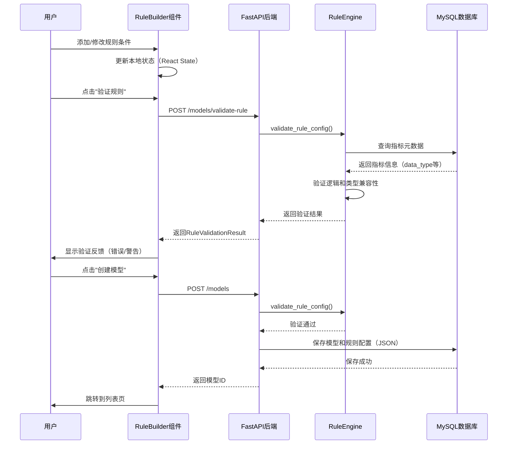

# FraudHunter 可视化规则引擎完整实现指南

## 文档信息
- **版本**: v2.0.0（支持高级操作符）
- **创建日期**: 2025-12-05
- **作者**: Claude Code
- **说明**: 本文档整合了基础规则引擎和高级操作符（in/not in/regexp/not regexp）的完整实现方案

## 目录
1. [整体架构设计](#1-整体架构设计)
2. [操作符支持](#2-操作符支持)
3. [前端实现方案](#3-前端实现方案)
4. [后端实现方案](#4-后端实现方案)
5. [使用示例](#5-使用示例)
6. [开发清单](#6-开发清单)

---

## 1. 整体架构设计

### 数据流向
```
用户交互 → RuleBuilder组件
         ↓
      规则JSON生成
         ↓
      后端验证API
         ↓
    规则持久化(MySQL)
         ↓
    规则执行引擎(RuleEngine)
         ↓
  Spark SQL执行 / Python运行时评估
```

### 技术栈
| 层级 | 技术选型 | 用途 |
|------|---------|------|
| 前端UI | React 18 + TypeScript | 组件化开发 |
| 前端组件 | Radix UI + Tailwind CSS | UI组件库和样式 |
| 后端框架 | FastAPI 0.116 | REST API |
| 数据验证 | Pydantic 2.0 | 数据模型和验证 |
| 规则引擎 | 自研RuleEngine | 规则解析和执行 |

---

## 2. 操作符支持

### 完整操作符列表

| 操作符类型 | 操作符 | 语法示例 | 说明 | 适用数据类型 |
|-----------|-------|---------|------|------------|
| **基础比较** | `>`, `>=`, `<`, `<=` | `> 10` | 数值比较 | numeric |
| | `=`, `!=` | `= 'value'` | 相等/不等 | all |
| **集合操作** | `in` | `in ('a','b','c')` | 值在集合内 | numeric, enum, text |
| | `not in` | `not in ('x','y')` | 值不在集合内 | numeric, enum, text |
| **正则匹配** | `regexp` | `regexp 'ab\|cd'` | 包含模式 | text |
| | `not regexp` | `not regexp 'xx\|ff'` | 不包含模式 | text |

### 操作符兼容性矩阵

| 数据类型 | 支持的操作符 |
|---------|------------|
| **numeric** | `>`, `>=`, `<`, `<=`, `=`, `!=`, `in`, `not in` |
| **enum** | `=`, `!=`, `in`, `not in` |
| **text** | `=`, `!=`, `in`, `not in`, `regexp`, `not regexp` |
| **boolean** | `=`, `!=` |

---

## 3. 前端实现方案

### 核心文件列表

```
frontend/
├── types/fraudhunter/rule.ts           # TypeScript类型定义
├── components/fraudhunter/model/
│   ├── RuleBuilder.tsx                  # 主规则构建器
│   ├── ConditionRuleEditor.tsx          # 条件编辑器（支持高级操作符）
│   ├── RuleOutputEditor.tsx             # 输出配置编辑器
│   └── RulePreview.tsx                  # 规则预览
└── lib/services/fraudhunter/
    └── modelService.ts                  # API服务封装
```

### 关键实现要点

#### 1. 类型定义（支持多值和正则）

**文件**: `frontend/types/fraudhunter/rule.ts`

```typescript
// 完整操作符类型
export type ComparisonOperator =
  | '>' | '>=' | '<' | '<=' | '=' | '!='      // 基础比较
  | 'in' | 'not in'                            // 集合操作
  | 'regexp' | 'not regexp'                    // 正则匹配

// 条件规则（value支持数组）
export interface ConditionRule {
  type: 'condition'
  indicator: string
  operator: ComparisonOperator
  value: string | number | boolean | string[] | number[]  // 关键：支持数组
}

// 操作符配置（用于UI分组显示）
export const OPERATOR_GROUPS = {
  comparison: [
    { value: '>', label: '大于 (>)', requiresMultiValue: false, requiresRegexp: false },
    // ... 其他基础操作符
  ],
  set: [
    { value: 'in', label: '在集合内 (IN)', requiresMultiValue: true, requiresRegexp: false },
    { value: 'not in', label: '不在集合内 (NOT IN)', requiresMultiValue: true, requiresRegexp: false },
  ],
  pattern: [
    { value: 'regexp', label: '正则匹配 (REGEXP)', requiresMultiValue: false, requiresRegexp: true },
    { value: 'not regexp', label: '正则不匹配 (NOT REGEXP)', requiresMultiValue: false, requiresRegexp: true },
  ],
}
```

#### 2. 条件编辑器核心逻辑

**文件**: `frontend/components/fraudhunter/model/ConditionRuleEditor.tsx`

**关键功能**：
- ✅ 根据指标数据类型动态限制可用操作符
- ✅ 操作符切换时自动转换值类型（单值 ↔ 多值）
- ✅ 多值输入组件（MultiValueInput）
- ✅ 正则表达式输入组件（RegexpInput）带实时验证

```typescript
// 操作符兼容性判断
const getAllowedOperatorsForType = (dataType?: string): ComparisonOperator[] => {
  switch (dataType) {
    case 'numeric': return ['>', '>=', '<', '<=', '=', '!=', 'in', 'not in']
    case 'enum': return ['=', '!=', 'in', 'not in']
    case 'text': return ['=', '!=', 'in', 'not in', 'regexp', 'not regexp']
    case 'boolean': return ['=', '!=']
    default: return ['>', '>=', '<', '<=', '=', '!=']
  }
}

// 操作符切换时的值类型转换
const handleOperatorChange = (newOperator: ComparisonOperator) => {
  let newValue = rule.value
  
  // 从单值切换到多值（in/not in）
  if (!isMultiValueOperator(rule.operator) && isMultiValueOperator(newOperator)) {
    newValue = rule.value !== '' ? [rule.value] : []
  }
  // 从多值切换到单值
  else if (isMultiValueOperator(rule.operator) && !isMultiValueOperator(newOperator)) {
    newValue = Array.isArray(rule.value) && rule.value.length > 0
      ? rule.value[0]
      : getDefaultValue(currentIndicator?.data_type)
  }
  
  onChange({ ...rule, operator: newOperator, value: newValue })
}
```

**MultiValueInput 组件**（用于 in/not in）:
```typescript
function MultiValueInput({ dataType, values, onAdd, onRemove }) {
  return (
    <div>
      {/* 已添加的值显示为Badge，可点击删除 */}
      {values.map((val, idx) => (
        <Badge>
          {val}
          <X onClick={() => onRemove(idx)} />
        </Badge>
      ))}
      
      {/* 输入框（支持回车添加） */}
      <Input 
        onKeyDown={(e) => e.key === 'Enter' && handleAdd()}
      />
    </div>
  )
}
```

**RegexpInput 组件**（用于 regexp/not regexp）:
```typescript
function RegexpInput({ value, onChange }) {
  const [isValid, setIsValid] = useState(true)
  
  const handleChange = (newValue: string) => {
    onChange(newValue)
    
    // 实时验证正则表达式
    try {
      new RegExp(newValue)
      setIsValid(true)
    } catch (e) {
      setIsValid(false)
      setError(e.message)
    }
  }
  
  return (
    <div>
      <Textarea className={!isValid ? 'border-destructive' : ''} />
      {!isValid && <div className="text-destructive">{error}</div>}
      
      {/* 常用模式提示 */}
      <div>
        • <code>ab|cd</code> - 包含 ab 或 cd
        • <code>^yy|^ii</code> - 以 yy 或 ii 开头
      </div>
    </div>
  )
}
```

---

## 4. 后端实现方案

### 核心文件列表

```
backend/
├── schemas/fraudhunter/rule.py          # Pydantic数据模型
├── services/fraudhunter/model_service/
│   └── rule_engine.py                    # 规则引擎核心
└── api/fraudhunter/model_routes.py      # API路由
```

### 关键实现要点

#### 1. Pydantic模型（支持多值验证）

**文件**: `backend/schemas/fraudhunter/rule.py`

```python
from pydantic import BaseModel, Field, field_validator
from typing import Literal, Union, List

# 完整操作符类型
ComparisonOperator = Literal[
    ">", ">=", "<", "<=", "=", "!=",      # 基础
    "in", "not in",                       # 集合
    "regexp", "not regexp"                # 正则
]

class ConditionRule(BaseModel):
    type: Literal["condition"]
    indicator: str
    operator: ComparisonOperator
    value: Union[str, int, float, bool, List[str], List[int], List[float]]  # 支持数组
    
    @field_validator('value')
    @classmethod
    def validate_value_type(cls, v, info):
        """验证值类型与操作符匹配"""
        operator = info.data.get('operator')
        
        # in/not in 必须是数组
        if operator in ['in', 'not in']:
            if not isinstance(v, list):
                raise ValueError(f"操作符 {operator} 需要数组类型的值")
            if len(v) == 0:
                raise ValueError(f"操作符 {operator} 的值数组不能为空")
        
        # 其他操作符不应该是数组
        elif isinstance(v, list):
            raise ValueError(f"操作符 {operator} 不支持数组类型的值")
        
        return v
```

#### 2. 规则引擎核心逻辑

**文件**: `backend/services/fraudhunter/model_service/rule_engine.py`

```python
import re
from typing import Dict, List, Any

class RuleEngine:
    """规则引擎 - 支持完整操作符"""
    
    # 操作符兼容性矩阵
    ALLOWED_OPERATORS = {
        'numeric': ['>', '>=', '<', '<=', '=', '!=', 'in', 'not in'],
        'enum': ['=', '!=', 'in', 'not in'],
        'text': ['=', '!=', 'in', 'not in', 'regexp', 'not regexp'],
        'boolean': ['=', '!=']
    }
    
    def evaluate_rule(self, rule_config: RuleConfig, indicator_values: Dict[str, Any]) -> bool:
        """执行规则评估（支持所有操作符）"""
        
        def evaluate_condition(condition: ConditionRule) -> bool:
            actual_value = indicator_values.get(condition.indicator)
            operator = condition.operator
            expected_value = condition.value
            
            # 基础比较
            if operator in ['>', '>=', '<', '<=', '=', '!=']:
                return self._evaluate_basic_comparison(actual_value, operator, expected_value)
            
            # 集合操作
            elif operator in ['in', 'not in']:
                return self._evaluate_set_operation(actual_value, operator, expected_value)
            
            # 正则匹配
            elif operator in ['regexp', 'not regexp']:
                return self._evaluate_regexp_operation(actual_value, operator, expected_value)
        
        # ... 递归评估逻辑
    
    def _evaluate_set_operation(self, actual: Any, operator: str, expected: List[Any]) -> bool:
        """集合操作（in / not in）"""
        # 类型转换
        if expected and isinstance(expected[0], (int, float)):
            actual = float(actual)
            expected = [float(v) for v in expected]
        else:
            actual = str(actual)
            expected = [str(v) for v in expected]
        
        # 判断
        if operator == 'in':
            return actual in expected
        elif operator == 'not in':
            return actual not in expected
    
    def _evaluate_regexp_operation(self, actual: Any, operator: str, pattern: str) -> bool:
        """正则操作（regexp / not regexp）"""
        actual_str = str(actual)
        
        try:
            compiled_pattern = re.compile(pattern)
            match = compiled_pattern.search(actual_str)
            
            if operator == 'regexp':
                return match is not None
            elif operator == 'not regexp':
                return match is None
        except re.error as e:
            logger.error(f"正则表达式编译失败: {pattern}, 错误: {e}")
            return False
    
    def generate_sql_expression(self, rule_config: RuleConfig) -> str:
        """生成SQL WHERE子句（支持所有操作符）"""
        
        def condition_to_sql(condition: ConditionRule) -> str:
            indicator = condition.indicator
            operator = condition.operator
            value = condition.value
            
            # 基础比较
            if operator in ['>', '>=', '<', '<=', '=', '!=']:
                return f"{indicator} {operator} {format_value(value)}"
            
            # 集合操作
            elif operator in ['in', 'not in']:
                values_str = ', '.join([format_value(v) for v in value])
                op_sql = 'IN' if operator == 'in' else 'NOT IN'
                return f"{indicator} {op_sql} ({values_str})"
            
            # 正则匹配（Spark SQL语法）
            elif operator in ['regexp', 'not regexp']:
                pattern_escaped = value.replace("'", "''")
                if operator == 'regexp':
                    return f"{indicator} RLIKE '{pattern_escaped}'"
                else:
                    return f"NOT ({indicator} RLIKE '{pattern_escaped}')"
        
        # ... 递归生成SQL
```

#### 3. 规则验证逻辑

```python
def _validate_operator_compatibility(self, config, result):
    """验证操作符与数据类型的兼容性"""
    
    def validate_condition(condition: ConditionRule, path: str):
        data_type = indicator_types.get(condition.indicator)
        allowed = self.ALLOWED_OPERATORS.get(data_type, [])
        
        if condition.operator not in allowed:
            result.errors.append(
                f"{path}: 指标 {condition.indicator} (类型:{data_type}) "
                f"不支持操作符 {condition.operator}"
            )
        
        # 验证 in/not in 的值必须是数组
        if condition.operator in ['in', 'not in']:
            if not isinstance(condition.value, list):
                result.errors.append(f"{path}: 操作符 {condition.operator} 需要数组类型的值")
        
        # 验证正则表达式语法
        if condition.operator in ['regexp', 'not regexp']:
            try:
                re.compile(condition.value)
            except re.error as e:
                result.errors.append(f"{path}: 正则表达式语法错误: {str(e)}")
```

---

## 5. 使用示例

### 示例1: 集合操作 - 检测高风险用户状态

```json
{
  "logic": "AND",
  "rules": [
    {
      "type": "condition",
      "indicator": "i_user_status",
      "operator": "in",
      "value": ["suspended", "banned", "frozen"]
    },
    {
      "type": "condition",
      "indicator": "i_login_cnt_7d",
      "operator": ">",
      "value": 5
    }
  ],
  "output": {
    "risk_level": "high",
    "risk_score": 80,
    "action": "block"
  }
}
```

**生成的SQL**:
```sql
(i_user_status IN ('suspended', 'banned', 'frozen') AND i_login_cnt_7d > 5)
```

### 示例2: 正则匹配 - 检测测试账号

```json
{
  "logic": "OR",
  "rules": [
    {
      "type": "condition",
      "indicator": "i_user_name",
      "operator": "regexp",
      "value": "^admin|^test|^demo"
    },
    {
      "type": "condition",
      "indicator": "i_email",
      "operator": "regexp",
      "value": "@temp\\.|@fake\\."
    }
  ],
  "output": {
    "risk_level": "medium",
    "risk_score": 60,
    "action": "review"
  }
}
```

**生成的SQL**:
```sql
(i_user_name RLIKE '^admin|^test|^demo' OR i_email RLIKE '@temp\\.|@fake\\.')
```

### 示例3: 复杂组合 - 异常登录检测

```json
{
  "logic": "AND",
  "rules": [
    {
      "type": "condition",
      "indicator": "i_login_ip",
      "operator": "not regexp",
      "value": "^192\\.168\\.|^10\\."
    },
    {
      "type": "group",
      "logic": "OR",
      "rules": [
        {
          "type": "condition",
          "indicator": "i_login_device_type",
          "operator": "in",
          "value": ["unknown", "simulator", "rooted"]
        },
        {
          "type": "condition",
          "indicator": "i_login_time",
          "operator": "regexp",
          "value": "^(0[0-4]|23):"
        }
      ]
    }
  ],
  "output": {
    "risk_level": "critical",
    "risk_score": 95,
    "action": "block"
  }
}
```

**生成的SQL**:
```sql
(
  NOT (i_login_ip RLIKE '^192\\.168\\.|^10\\.')
  AND
  (
    i_login_device_type IN ('unknown', 'simulator', 'rooted')
    OR
    i_login_time RLIKE '^(0[0-4]|23):'
  )
)
```

### 常用正则表达式模式参考

```regexp
# 电话号码
^1[3-9]\d{9}$         # 中国手机号
^\d{11}$              # 11位数字

# 邮箱
@qq\.com$             # QQ邮箱
@(163|126|yeah)\.com$ # 网易邮箱

# 用户名
^admin|^test|^demo    # 以admin、test或demo开头
_test$|_tmp$          # 以_test或_tmp结尾

# IP地址
^192\.168\.|^10\.     # 内网IP
^(127\.|::1)          # 本地回环

# 时间
^(0[0-5]|23):         # 凌晨0-5点或23点
^(09|10|11|12|13|14): # 工作时间
```

---

## 6. 开发清单

### 前端开发任务

- [ ] **类型定义**
  - [ ] 创建 `types/fraudhunter/rule.ts`（包含高级操作符）
  - [ ] 定义 `OPERATOR_GROUPS` 常量

- [ ] **核心组件**
  - [ ] `RuleBuilder.tsx` - 主规则构建器
  - [ ] `ConditionRuleEditor.tsx` - 条件编辑器（包含 MultiValueInput 和 RegexpInput）
  - [ ] `RuleOutputEditor.tsx` - 输出配置编辑器
  - [ ] `RulePreview.tsx` - 规则预览（支持数组值显示）

- [ ] **API服务**
  - [ ] `modelService.ts` - 封装 validateRule、previewSQL、evaluateRule

### 后端开发任务

- [ ] **数据模型**
  - [ ] `schemas/fraudhunter/rule.py`（包含 field_validator 验证逻辑）

- [ ] **核心服务**
  - [ ] `rule_engine.py` - 实现三个评估方法：
    - [ ] `_evaluate_basic_comparison`
    - [ ] `_evaluate_set_operation`
    - [ ] `_evaluate_regexp_operation`
  - [ ] SQL生成支持 IN/NOT IN/RLIKE

- [ ] **API路由**
  - [ ] `model_routes.py` - 三个核心端点：
    - [ ] `POST /models/validate-rule`
    - [ ] `POST /models/preview-sql`
    - [ ] `POST /models/evaluate-rule`

### 测试任务

- [ ] **单元测试**
  - [ ] 集合操作测试（in/not in，空数组、类型转换）
  - [ ] 正则匹配测试（语法错误、特殊字符转义）
  - [ ] SQL生成测试（验证生成的SQL正确性）

- [ ] **集成测试**
  - [ ] 前端操作符切换时值类型自动转换
  - [ ] 正则表达式实时验证
  - [ ] 复杂嵌套规则的SQL生成

---

## 附录

### A. 关键技术要点

1. **递归组件设计**: RuleBuilder通过depth参数控制嵌套深度（最多3层）
2. **类型安全**: 前后端使用相同的类型结构（TypeScript ↔ Pydantic）
3. **操作符兼容性**: 根据指标数据类型动态限制可用操作符
4. **值类型自动转换**: 操作符切换时自动在单值和多值之间转换
5. **实时验证**: 正则表达式输入时实时验证语法
6. **SQL生成**: 支持Spark SQL的 IN/NOT IN/RLIKE 语法

### B. API端点汇总

| 端点 | 方法 | 功能 |
|-----|------|-----|
| `/models/validate-rule` | POST | 验证规则配置（检查指标存在性、操作符兼容性、正则语法） |
| `/models/preview-sql` | POST | 生成Spark SQL WHERE子句 |
| `/models/evaluate-rule` | POST | 运行时评估规则（用于测试） |
| `/models` | POST | 创建模型 |
| `/models/{id}` | GET | 获取模型详情 |
| `/models/{id}` | PUT | 更新模型 |

### C. 性能优化建议

1. **前端**: useMemo缓存指标列表、防抖验证API调用
2. **后端**: 缓存指标元数据查询、批量验证规则
3. **数据库**: 指标编码字段添加索引

---

**文档结束**

如需查看完整的组件代码，请参考原始文档 `rule_engine_implementation_guide.md`。
# FraudHunter 可视化规则引擎实现指南

## 文档信息
- **版本**: v1.0.0
- **创建日期**: 2025-12-05
- **作者**: Claude Code
- **关联文档**: [anti_fraud_indicator_model_design.md](./anti_fraud_indicator_model_design.md)

## 目录
1. [整体架构设计](#整体架构设计)
2. [前端实现方案](#前端实现方案)
3. [后端实现方案](#后端实现方案)
4. [核心交互流程](#核心交互流程)
5. [关键技术要点](#关键技术要点)
6. [开发清单](#开发清单)

---

## 整体架构设计

### 数据流向

```
用户交互 → RuleBuilder组件
         ↓
      规则JSON生成
         ↓
      后端验证API
         ↓
    规则持久化(MySQL)
         ↓
    规则执行引擎(RuleEngine)
         ↓
  Spark SQL执行 / Python运行时评估
```

### 技术栈

| 层级 | 技术选型 | 用途 |
|------|---------|------|
| 前端UI | React 18 + TypeScript | 组件化开发 |
| 前端组件 | Radix UI + Tailwind CSS | UI组件库和样式 |
| 前端状态 | React useState + useEffect | 本地状态管理 |
| 后端框架 | FastAPI 0.116 | REST API |
| 数据验证 | Pydantic 2.0 | 数据模型和验证 |
| 数据库 | MySQL 8.0 | 规则配置持久化 |
| 规则引擎 | 自研RuleEngine | 规则解析和执行 |

---

## 前端实现方案

### 1. 核心数据结构

**文件**: `frontend/types/fraudhunter/rule.ts`

```typescript
// ==================== 基础类型定义 ====================

// 比较操作符
export type ComparisonOperator = '>' | '>=' | '<' | '<=' | '=' | '!='

// 逻辑操作符
export type LogicOperator = 'AND' | 'OR'

// 规则类型
export type RuleType = 'condition' | 'group'

// 指标数据类型
export type IndicatorDataType = 'numeric' | 'enum' | 'boolean' | 'text'

// ==================== 规则结构定义 ====================

// 条件规则
export interface ConditionRule {
  type: 'condition'
  indicator: string           // 指标编码，如 'i_login_cnt_7d'
  operator: ComparisonOperator
  value: string | number | boolean
}

// 规则组（支持嵌套）
export interface GroupRule {
  type: 'group'
  logic: LogicOperator
  rules: Rule[]
}

// 联合类型
export type Rule = ConditionRule | GroupRule

// ==================== 输出配置 ====================

export interface RuleOutput {
  risk_level: 'low' | 'medium' | 'high' | 'critical'
  risk_score: number          // 0-100
  action?: 'block' | 'review' | 'alert' | 'pass'
  description?: string
}

// ==================== 完整规则配置 ====================

export interface RuleConfig {
  logic: LogicOperator
  rules: Rule[]
  output: RuleOutput
}

// ==================== 辅助类型 ====================

// 指标信息（用于下拉选择）
export interface Indicator {
  indicator_code: string
  indicator_name: string
  data_type: IndicatorDataType
  enum_values?: string[]      // 枚举类型的可选值
  description?: string
}

// 规则验证结果
export interface RuleValidationResult {
  valid: boolean
  errors: string[]
  warnings: string[]
  extracted_indicators: string[]
}
```

### 2. 组件架构设计

```
components/fraudhunter/model/
├── RuleBuilder.tsx              # 主规则构建器（递归组件）
├── ConditionRuleEditor.tsx      # 条件规则编辑器
├── RuleOutputEditor.tsx         # 输出配置编辑器
├── RulePreview.tsx              # 规则预览组件
└── RuleValidationFeedback.tsx   # 验证反馈组件
```

### 3. 主规则构建器组件

**文件**: `frontend/components/fraudhunter/model/RuleBuilder.tsx`

```tsx
import { useState } from 'react'
import { Card } from '@/components/ui/card'
import { Button } from '@/components/ui/button'
import { Select, SelectContent, SelectItem, SelectTrigger, SelectValue } from '@/components/ui/select'
import { Badge } from '@/components/ui/badge'
import { Trash2, Plus, GripVertical } from 'lucide-react'
import { ConditionRuleEditor } from './ConditionRuleEditor'
import { RuleOutput, RuleConfig, Rule, Indicator } from '@/types/fraudhunter/rule'

interface RuleBuilderProps {
  value: RuleConfig
  indicators: Indicator[]
  onChange: (config: RuleConfig) => void
  depth?: number  // 用于控制嵌套深度，防止过深
}

export function RuleBuilder({
  value,
  indicators,
  onChange,
  depth = 0
}: RuleBuilderProps) {
  const maxDepth = 3  // 最大嵌套3层

  // ==================== 规则操作方法 ====================

  // 添加条件规则
  const addCondition = () => {
    const newCondition: Rule = {
      type: 'condition',
      indicator: indicators[0]?.indicator_code || '',
      operator: '>',
      value: 0
    }

    onChange({
      ...value,
      rules: [...value.rules, newCondition]
    })
  }

  // 添加规则组
  const addGroup = () => {
    if (depth >= maxDepth) {
      alert(`最多支持${maxDepth}层嵌套`)
      return
    }

    const newGroup: Rule = {
      type: 'group',
      logic: 'AND',
      rules: []
    }

    onChange({
      ...value,
      rules: [...value.rules, newGroup]
    })
  }

  // 删除规则
  const removeRule = (index: number) => {
    const newRules = value.rules.filter((_, i) => i !== index)
    onChange({ ...value, rules: newRules })
  }

  // 更新规则
  const updateRule = (index: number, updatedRule: Rule) => {
    const newRules = [...value.rules]
    newRules[index] = updatedRule
    onChange({ ...value, rules: newRules })
  }

  // 更新逻辑操作符
  const updateLogic = (logic: 'AND' | 'OR') => {
    onChange({ ...value, logic })
  }

  // ==================== 渲染逻辑 ====================

  return (
    <Card className={`p-4 ${depth > 0 ? 'ml-6 border-l-4 border-primary/30' : ''}`}>
      {/* 逻辑操作符选择 */}
      <div className="flex items-center justify-between mb-4">
        <div className="flex items-center space-x-2">
          {depth > 0 && <GripVertical className="h-4 w-4 text-muted-foreground" />}
          <Badge variant={depth === 0 ? "default" : "secondary"}>
            {depth === 0 ? '根规则组' : `规则组 (层级${depth})`}
          </Badge>
        </div>

        <Select value={value.logic} onValueChange={updateLogic}>
          <SelectTrigger className="w-[180px]">
            <SelectValue />
          </SelectTrigger>
          <SelectContent>
            <SelectItem value="AND">AND (所有满足)</SelectItem>
            <SelectItem value="OR">OR (任一满足)</SelectItem>
          </SelectContent>
        </Select>
      </div>

      {/* 规则列表 */}
      <div className="space-y-3">
        {value.rules.map((rule, index) => (
          <div key={index} className="flex items-start space-x-2">
            <div className="flex-1">
              {rule.type === 'condition' ? (
                <ConditionRuleEditor
                  rule={rule}
                  indicators={indicators}
                  onChange={(updated) => updateRule(index, updated)}
                />
              ) : (
                <RuleBuilder
                  value={rule}
                  indicators={indicators}
                  onChange={(updated) => updateRule(index, updated)}
                  depth={depth + 1}
                />
              )}
            </div>

            {/* 删除按钮 */}
            <Button
              variant="ghost"
              size="icon"
              onClick={() => removeRule(index)}
              className="shrink-0 mt-1"
            >
              <Trash2 className="h-4 w-4 text-destructive" />
            </Button>
          </div>
        ))}

        {value.rules.length === 0 && (
          <div className="text-center py-8 text-muted-foreground border-2 border-dashed rounded-lg">
            暂无规则，请添加条件或规则组
          </div>
        )}
      </div>

      {/* 添加按钮 */}
      <div className="flex space-x-2 mt-4">
        <Button
          variant="outline"
          size="sm"
          onClick={addCondition}
          disabled={indicators.length === 0}
        >
          <Plus className="h-4 w-4 mr-1" />
          添加条件
        </Button>

        {depth < maxDepth && (
          <Button
            variant="outline"
            size="sm"
            onClick={addGroup}
          >
            <Plus className="h-4 w-4 mr-1" />
            添加规则组
          </Button>
        )}
      </div>
    </Card>
  )
}
```

### 4. 条件规则编辑器组件

**文件**: `frontend/components/fraudhunter/model/ConditionRuleEditor.tsx`

```tsx
import { Input } from '@/components/ui/input'
import { Select, SelectContent, SelectItem, SelectTrigger, SelectValue } from '@/components/ui/select'
import { Card } from '@/components/ui/card'
import { ConditionRule, Indicator, ComparisonOperator } from '@/types/fraudhunter/rule'

interface ConditionRuleEditorProps {
  rule: ConditionRule
  indicators: Indicator[]
  onChange: (rule: ConditionRule) => void
}

export function ConditionRuleEditor({ rule, indicators, onChange }: ConditionRuleEditorProps) {
  // 获取当前指标信息
  const currentIndicator = indicators.find(ind => ind.indicator_code === rule.indicator)

  // ==================== 操作符兼容性逻辑 ====================

  // 根据数据类型获取允许的操作符
  const getAllowedOperatorsForType = (dataType?: string): ComparisonOperator[] => {
    switch (dataType) {
      case 'numeric':
        return ['>', '>=', '<', '<=', '=', '!=']
      case 'enum':
      case 'text':
        return ['=', '!=']
      case 'boolean':
        return ['=']
      default:
        return ['>', '>=', '<', '<=', '=', '!=']
    }
  }

  const allowedOperators = getAllowedOperatorsForType(currentIndicator?.data_type)

  // ==================== 指标变更处理 ====================

  // 更新指标时重置操作符和值
  const handleIndicatorChange = (indicatorCode: string) => {
    const newIndicator = indicators.find(ind => ind.indicator_code === indicatorCode)
    const newAllowedOps = getAllowedOperatorsForType(newIndicator?.data_type)

    onChange({
      ...rule,
      indicator: indicatorCode,
      operator: newAllowedOps[0] || '>',
      value: getDefaultValue(newIndicator?.data_type)
    })
  }

  const getDefaultValue = (dataType?: string) => {
    switch (dataType) {
      case 'boolean': return false
      case 'numeric': return 0
      case 'enum': return ''
      default: return ''
    }
  }

  // ==================== 值输入控件渲染 ====================

  const renderValueInput = () => {
    if (!currentIndicator) return null

    switch (currentIndicator.data_type) {
      case 'numeric':
        return (
          <Input
            type="number"
            value={rule.value as number}
            onChange={(e) => onChange({ ...rule, value: Number(e.target.value) })}
            className="w-32"
            placeholder="输入数值"
          />
        )

      case 'boolean':
        return (
          <Select
            value={String(rule.value)}
            onValueChange={(v) => onChange({ ...rule, value: v === 'true' })}
          >
            <SelectTrigger className="w-32">
              <SelectValue />
            </SelectTrigger>
            <SelectContent>
              <SelectItem value="true">真</SelectItem>
              <SelectItem value="false">假</SelectItem>
            </SelectContent>
          </Select>
        )

      case 'enum':
        return (
          <Select
            value={String(rule.value)}
            onValueChange={(v) => onChange({ ...rule, value: v })}
          >
            <SelectTrigger className="w-40">
              <SelectValue placeholder="选择值" />
            </SelectTrigger>
            <SelectContent>
              {currentIndicator.enum_values?.map((val) => (
                <SelectItem key={val} value={val}>{val}</SelectItem>
              ))}
            </SelectContent>
          </Select>
        )

      default:
        return (
          <Input
            type="text"
            value={String(rule.value)}
            onChange={(e) => onChange({ ...rule, value: e.target.value })}
            className="w-40"
            placeholder="输入文本"
          />
        )
    }
  }

  // ==================== 渲染逻辑 ====================

  return (
    <Card className="p-3 bg-muted/50">
      <div className="flex items-center space-x-2 flex-wrap gap-2">
        {/* 指标选择 */}
        <Select value={rule.indicator} onValueChange={handleIndicatorChange}>
          <SelectTrigger className="w-[200px]">
            <SelectValue placeholder="选择指标" />
          </SelectTrigger>
          <SelectContent>
            {indicators.map((ind) => (
              <SelectItem key={ind.indicator_code} value={ind.indicator_code}>
                <div className="flex items-center justify-between">
                  <span>{ind.indicator_name}</span>
                  <span className="text-xs text-muted-foreground ml-2">
                    ({ind.data_type})
                  </span>
                </div>
              </SelectItem>
            ))}
          </SelectContent>
        </Select>

        {/* 操作符选择 */}
        <Select
          value={rule.operator}
          onValueChange={(v) => onChange({ ...rule, operator: v as ComparisonOperator })}
        >
          <SelectTrigger className="w-[120px]">
            <SelectValue />
          </SelectTrigger>
          <SelectContent>
            {allowedOperators.map((op) => (
              <SelectItem key={op} value={op}>
                {getOperatorLabel(op)}
              </SelectItem>
            ))}
          </SelectContent>
        </Select>

        {/* 值输入 */}
        {renderValueInput()}
      </div>
    </Card>
  )
}

// ==================== 辅助函数 ====================

// 操作符中文标签
function getOperatorLabel(operator: ComparisonOperator): string {
  const labels: Record<ComparisonOperator, string> = {
    '>': '大于 (>)',
    '>=': '大于等于 (≥)',
    '<': '小于 (<)',
    '<=': '小于等于 (≤)',
    '=': '等于 (=)',
    '!=': '不等于 (≠)'
  }
  return labels[operator]
}
```

### 5. 输出配置编辑器组件

**文件**: `frontend/components/fraudhunter/model/RuleOutputEditor.tsx`

```tsx
import { Input } from '@/components/ui/input'
import { Textarea } from '@/components/ui/textarea'
import { Select, SelectContent, SelectItem, SelectTrigger, SelectValue } from '@/components/ui/select'
import { Card } from '@/components/ui/card'
import { Label } from '@/components/ui/label'
import { Slider } from '@/components/ui/slider'
import { RuleOutput } from '@/types/fraudhunter/rule'
import { AlertTriangle, Shield, AlertCircle, XCircle } from 'lucide-react'

interface RuleOutputEditorProps {
  value: RuleOutput
  onChange: (output: RuleOutput) => void
}

export function RuleOutputEditor({ value, onChange }: RuleOutputEditorProps) {
  // 风险等级对应的图标和颜色
  const getRiskLevelConfig = (level: string) => {
    const configs = {
      low: { icon: Shield, color: 'text-green-600', bgColor: 'bg-green-50' },
      medium: { icon: AlertCircle, color: 'text-yellow-600', bgColor: 'bg-yellow-50' },
      high: { icon: AlertTriangle, color: 'text-orange-600', bgColor: 'bg-orange-50' },
      critical: { icon: XCircle, color: 'text-red-600', bgColor: 'bg-red-50' }
    }
    return configs[level as keyof typeof configs] || configs.medium
  }

  const riskConfig = getRiskLevelConfig(value.risk_level)
  const RiskIcon = riskConfig.icon

  return (
    <Card className="p-6">
      <div className="flex items-center mb-4">
        <RiskIcon className={`h-5 w-5 mr-2 ${riskConfig.color}`} />
        <h3 className="text-lg font-medium">规则命中后的输出配置</h3>
      </div>

      <div className="space-y-6">
        {/* 风险等级 */}
        <div>
          <Label className="text-base">风险等级</Label>
          <div className="grid grid-cols-4 gap-2 mt-2">
            {[
              { value: 'low', label: '低风险', color: 'bg-green-100 hover:bg-green-200' },
              { value: 'medium', label: '中风险', color: 'bg-yellow-100 hover:bg-yellow-200' },
              { value: 'high', label: '高风险', color: 'bg-orange-100 hover:bg-orange-200' },
              { value: 'critical', label: '严重', color: 'bg-red-100 hover:bg-red-200' }
            ].map((level) => (
              <button
                key={level.value}
                type="button"
                className={`p-3 rounded-lg text-sm font-medium transition-colors ${
                  value.risk_level === level.value
                    ? `${level.color} ring-2 ring-primary`
                    : `${level.color} opacity-50`
                }`}
                onClick={() => onChange({ ...value, risk_level: level.value as any })}
              >
                {level.label}
              </button>
            ))}
          </div>
        </div>

        {/* 风险分数 */}
        <div>
          <div className="flex items-center justify-between mb-2">
            <Label className="text-base">风险分数</Label>
            <span className="text-2xl font-bold text-primary">{value.risk_score}</span>
          </div>
          <Slider
            value={[value.risk_score]}
            onValueChange={([score]) => onChange({ ...value, risk_score: score })}
            min={0}
            max={100}
            step={1}
            className="mt-2"
          />
          <div className="flex justify-between text-xs text-muted-foreground mt-1">
            <span>0 (无风险)</span>
            <span>100 (极高风险)</span>
          </div>
        </div>

        {/* 处理动作 */}
        <div>
          <Label className="text-base">处理动作（可选）</Label>
          <Select
            value={value.action || 'none'}
            onValueChange={(v) => onChange({ ...value, action: v === 'none' ? undefined : v as any })}
          >
            <SelectTrigger className="mt-2">
              <SelectValue />
            </SelectTrigger>
            <SelectContent>
              <SelectItem value="none">无自动处理</SelectItem>
              <SelectItem value="pass">放行通过</SelectItem>
              <SelectItem value="alert">发送告警</SelectItem>
              <SelectItem value="review">人工审核</SelectItem>
              <SelectItem value="block">直接拦截</SelectItem>
            </SelectContent>
          </Select>
        </div>

        {/* 描述 */}
        <div>
          <Label className="text-base">输出描述（可选）</Label>
          <Textarea
            value={value.description || ''}
            onChange={(e) => onChange({ ...value, description: e.target.value })}
            rows={3}
            className="mt-2"
            placeholder="描述规则命中后的处理逻辑、业务含义等..."
          />
        </div>
      </div>
    </Card>
  )
}
```

### 6. 规则预览组件

**文件**: `frontend/components/fraudhunter/model/RulePreview.tsx`

```tsx
import { Card } from '@/components/ui/card'
import { Badge } from '@/components/ui/badge'
import { RuleConfig, Rule } from '@/types/fraudhunter/rule'
import { FileJson, Eye } from 'lucide-react'
import { Tabs, TabsContent, TabsList, TabsTrigger } from '@/components/ui/tabs'

interface RulePreviewProps {
  config: RuleConfig
}

export function RulePreview({ config }: RulePreviewProps) {
  // ==================== 可视化渲染逻辑 ====================

  // 递归渲染规则树
  const renderRule = (rule: Rule, depth: number = 0, index?: number): JSX.Element => {
    const indentClass = `ml-${depth * 4}`

    if (rule.type === 'condition') {
      return (
        <div key={index} className={`${indentClass} py-1 flex items-center space-x-2`}>
          <Badge variant="outline" className="font-mono text-xs">
            {rule.indicator} {rule.operator} {String(rule.value)}
          </Badge>
        </div>
      )
    } else {
      return (
        <div key={index} className={`${indentClass} py-2`}>
          <Badge className="mb-2" variant={depth === 0 ? "default" : "secondary"}>
            {rule.logic}
          </Badge>
          <div className="ml-4 border-l-2 border-muted pl-2 space-y-1">
            {rule.rules.map((r, i) => renderRule(r, depth + 1, i))}
          </div>
        </div>
      )
    }
  }

  // ==================== 人类可读格式 ====================

  const renderHumanReadable = (rule: Rule, depth: number = 0): string => {
    const indent = '  '.repeat(depth)

    if (rule.type === 'condition') {
      return `${indent}• ${rule.indicator} ${rule.operator} ${rule.value}`
    } else {
      const logic = rule.logic === 'AND' ? '且' : '或'
      const rules = rule.rules.map(r => renderHumanReadable(r, depth + 1)).join('\n')
      return `${indent}${logic}:\n${rules}`
    }
  }

  const humanReadable = renderHumanReadable({
    type: 'group',
    logic: config.logic,
    rules: config.rules
  })

  // ==================== 渲染逻辑 ====================

  return (
    <Card className="p-6">
      <h3 className="text-lg font-medium mb-4 flex items-center">
        <Eye className="h-5 w-5 mr-2" />
        规则预览
      </h3>

      <Tabs defaultValue="visual" className="w-full">
        <TabsList className="mb-4">
          <TabsTrigger value="visual">可视化视图</TabsTrigger>
          <TabsTrigger value="readable">易读格式</TabsTrigger>
          <TabsTrigger value="json">JSON格式</TabsTrigger>
        </TabsList>

        {/* 可视化视图 */}
        <TabsContent value="visual" className="space-y-4">
          <div>
            <div className="text-sm font-medium mb-2 text-muted-foreground">规则逻辑：</div>
            {renderRule({ type: 'group', logic: config.logic, rules: config.rules })}
          </div>

          <div className="p-4 bg-muted/50 rounded-lg">
            <div className="text-sm font-medium mb-3">输出配置：</div>
            <div className="grid grid-cols-2 gap-3 text-sm">
              <div className="flex items-center space-x-2">
                <span className="text-muted-foreground">风险等级:</span>
                <Badge variant="default">{config.output.risk_level}</Badge>
              </div>
              <div className="flex items-center space-x-2">
                <span className="text-muted-foreground">风险分数:</span>
                <span className="font-semibold">{config.output.risk_score}</span>
              </div>
              {config.output.action && (
                <div className="flex items-center space-x-2">
                  <span className="text-muted-foreground">处理动作:</span>
                  <Badge variant="outline">{config.output.action}</Badge>
                </div>
              )}
              {config.output.description && (
                <div className="col-span-2">
                  <span className="text-muted-foreground">描述:</span>
                  <p className="text-sm mt-1">{config.output.description}</p>
                </div>
              )}
            </div>
          </div>
        </TabsContent>

        {/* 易读格式 */}
        <TabsContent value="readable">
          <pre className="bg-muted p-4 rounded-lg overflow-auto text-sm whitespace-pre-wrap">
            {humanReadable}
            {'\n\n'}
            {'输出配置:\n'}
            {`  • 风险等级: ${config.output.risk_level}\n`}
            {`  • 风险分数: ${config.output.risk_score}\n`}
            {config.output.action && `  • 处理动作: ${config.output.action}\n`}
            {config.output.description && `  • 描述: ${config.output.description}\n`}
          </pre>
        </TabsContent>

        {/* JSON视图 */}
        <TabsContent value="json">
          <pre className="bg-muted p-4 rounded-lg overflow-auto max-h-96 text-sm font-mono">
            {JSON.stringify(config, null, 2)}
          </pre>
        </TabsContent>
      </Tabs>
    </Card>
  )
}
```

### 7. API服务封装

**文件**: `frontend/lib/services/fraudhunter/modelService.ts`

```typescript
import api from '@/lib/api'
import type { RuleConfig, RuleValidationResult } from '@/types/fraudhunter/rule'

export interface ModelCreateRequest {
  model_code: string
  model_name: string
  description?: string
  rule_config: RuleConfig
  indicator_codes: string[]
  output_table?: string
}

export interface ModelResponse {
  id: number
  model_code: string
  model_name: string
  description?: string
  rule_config: RuleConfig
  indicator_codes: string[]
  current_version: number
  latest_version: number
  status: string
  created_at: string
}

export const modelService = {
  /**
   * 验证规则配置
   */
  async validateRule(ruleConfig: RuleConfig): Promise<RuleValidationResult> {
    const response = await api.post('/fraudhunter/models/validate-rule', ruleConfig)
    return response.data.data
  },

  /**
   * 预览规则SQL
   */
  async previewSQL(ruleConfig: RuleConfig): Promise<{ sql_expression: string; extracted_indicators: string[] }> {
    const response = await api.post('/fraudhunter/models/preview-sql', ruleConfig)
    return response.data.data
  },

  /**
   * 创建模型
   */
  async create(data: ModelCreateRequest): Promise<ModelResponse> {
    const response = await api.post('/fraudhunter/models', data)
    return response.data.data
  },

  /**
   * 获取模型列表
   */
  async list(params?: { status?: string; page?: number; page_size?: number }): Promise<{
    total: number
    page: number
    page_size: number
    items: ModelResponse[]
  }> {
    const response = await api.get('/fraudhunter/models', { params })
    return response.data.data
  },

  /**
   * 获取模型详情
   */
  async get(id: number): Promise<ModelResponse> {
    const response = await api.get(`/fraudhunter/models/${id}`)
    return response.data.data
  },

  /**
   * 更新模型
   */
  async update(id: number, data: Partial<ModelCreateRequest>): Promise<ModelResponse> {
    const response = await api.put(`/fraudhunter/models/${id}`, data)
    return response.data.data
  }
}
```

---

## 后端实现方案

### 1. Pydantic数据模型

**文件**: `backend/schemas/fraudhunter/rule.py`

```python
"""
FraudHunter规则引擎数据模型

定义规则配置的数据结构，用于：
1. API请求/响应验证
2. 规则存储和序列化
3. 规则执行和评估
"""

from typing import Literal, Union, List, Optional
from pydantic import BaseModel, Field, field_validator, model_validator

# ==================== 基础类型定义 ====================

# 比较操作符
ComparisonOperator = Literal[">", ">=", "<", "<=", "=", "!="]

# 逻辑操作符
LogicOperator = Literal["AND", "OR"]

# 指标数据类型
IndicatorDataType = Literal["numeric", "enum", "boolean", "text"]

# ==================== 规则结构定义 ====================

class ConditionRule(BaseModel):
    """条件规则：单个指标的比较判断"""

    type: Literal["condition"]
    indicator: str = Field(..., description="指标编码，如 i_login_cnt_7d")
    operator: ComparisonOperator = Field(..., description="比较操作符")
    value: Union[str, int, float, bool] = Field(..., description="比较值")

    class Config:
        json_schema_extra = {
            "example": {
                "type": "condition",
                "indicator": "i_login_cnt_7d",
                "operator": ">",
                "value": 10
            }
        }


class GroupRule(BaseModel):
    """规则组：多个规则的逻辑组合，支持嵌套"""

    type: Literal["group"]
    logic: LogicOperator = Field(..., description="逻辑操作符：AND/OR")
    rules: List["Rule"] = Field(..., description="子规则列表")

    @field_validator('rules')
    @classmethod
    def validate_rules_not_empty(cls, v):
        """验证规则列表不能为空"""
        if not v:
            raise ValueError("规则组的rules字段不能为空")
        return v

    class Config:
        json_schema_extra = {
            "example": {
                "type": "group",
                "logic": "AND",
                "rules": [
                    {
                        "type": "condition",
                        "indicator": "i_login_cnt_7d",
                        "operator": ">",
                        "value": 10
                    }
                ]
            }
        }


# 联合类型定义
Rule = Union[ConditionRule, GroupRule]

# 更新前向引用（Pydantic递归模型）
GroupRule.model_rebuild()

# ==================== 输出配置 ====================

class RuleOutput(BaseModel):
    """规则命中后的输出配置"""

    risk_level: Literal["low", "medium", "high", "critical"] = Field(
        ...,
        description="风险等级"
    )
    risk_score: int = Field(
        ...,
        ge=0,
        le=100,
        description="风险分数，范围0-100"
    )
    action: Optional[Literal["block", "review", "alert", "pass"]] = Field(
        None,
        description="处理动作：拦截/审核/告警/放行"
    )
    description: Optional[str] = Field(
        None,
        description="输出描述"
    )

    class Config:
        json_schema_extra = {
            "example": {
                "risk_level": "high",
                "risk_score": 85,
                "action": "review",
                "description": "高风险登录行为，需人工审核"
            }
        }


# ==================== 完整规则配置 ====================

class RuleConfig(BaseModel):
    """完整的规则配置"""

    logic: LogicOperator = Field(..., description="根逻辑操作符")
    rules: List[Rule] = Field(..., description="根规则列表")
    output: RuleOutput = Field(..., description="输出配置")

    @field_validator('rules')
    @classmethod
    def validate_rules_not_empty(cls, v):
        """验证根规则列表不能为空"""
        if not v:
            raise ValueError("规则配置的rules字段不能为空")
        return v

    class Config:
        json_schema_extra = {
            "example": {
                "logic": "AND",
                "rules": [
                    {
                        "type": "condition",
                        "indicator": "i_login_cnt_7d",
                        "operator": ">",
                        "value": 10
                    },
                    {
                        "type": "group",
                        "logic": "OR",
                        "rules": [
                            {
                                "type": "condition",
                                "indicator": "i_device_change_cnt",
                                "operator": ">=",
                                "value": 3
                            }
                        ]
                    }
                ],
                "output": {
                    "risk_level": "high",
                    "risk_score": 85,
                    "action": "review"
                }
            }
        }


# ==================== 验证结果 ====================

class RuleValidationResult(BaseModel):
    """规则验证结果"""

    valid: bool = Field(..., description="是否验证通过")
    errors: List[str] = Field(
        default_factory=list,
        description="错误信息列表"
    )
    warnings: List[str] = Field(
        default_factory=list,
        description="警告信息列表"
    )
    extracted_indicators: List[str] = Field(
        default_factory=list,
        description="提取到的指标编码列表"
    )

    class Config:
        json_schema_extra = {
            "example": {
                "valid": True,
                "errors": [],
                "warnings": ["规则嵌套深度为4，建议不超过3层"],
                "extracted_indicators": ["i_login_cnt_7d", "i_device_change_cnt"]
            }
        }
```

### 2. 规则引擎核心服务

**文件**: `backend/services/fraudhunter/model_service/rule_engine.py`

```python
"""
FraudHunter规则引擎

功能：
1. 规则验证：检查规则结构、指标存在性、操作符兼容性
2. 规则评估：执行规则判断，返回是否命中
3. SQL生成：将规则转换为Spark SQL表达式
"""

from typing import Dict, List, Set, Any, Optional
from backend.schemas.fraudhunter.rule import (
    RuleConfig, Rule, ConditionRule, GroupRule,
    ComparisonOperator, RuleValidationResult
)
from backend.models.fraudhunter.indicator import FraudHunterIndicatorDefinition
from sqlalchemy.orm import Session
from backend.utils.logger import logger


class RuleEngine:
    """规则引擎 - 验证、解析和执行规则"""

    def __init__(self, db: Session):
        self.db = db

    # ==================== 规则验证 ====================

    def validate_rule_config(self, rule_config: RuleConfig) -> RuleValidationResult:
        """
        验证规则配置的完整性和正确性

        验证内容：
        1. 指标是否存在
        2. 规则结构是否完整
        3. 操作符与数据类型是否兼容
        4. 输出配置是否合法
        5. 规则嵌套深度检查

        Args:
            rule_config: 规则配置

        Returns:
            RuleValidationResult: 验证结果
        """
        result = RuleValidationResult(valid=True)

        try:
            # 1. 提取所有使用的指标
            indicators = self._extract_indicators(rule_config)
            result.extracted_indicators = list(indicators)

            # 2. 验证指标是否存在
            self._validate_indicators_exist(indicators, result)

            # 3. 验证规则结构
            self._validate_rule_structure(rule_config, result)

            # 4. 验证数据类型和操作符匹配
            self._validate_operator_compatibility(rule_config, result)

            # 5. 验证输出配置
            self._validate_output_config(rule_config.output, result)

            # 6. 检查规则深度
            max_depth = self._get_max_depth(rule_config)
            if max_depth > 3:
                result.warnings.append(
                    f"规则嵌套深度为{max_depth}，建议不超过3层以保持可读性"
                )

            # 7. 统计规则数量
            rule_count = self._count_rules(rule_config)
            if rule_count > 20:
                result.warnings.append(
                    f"规则总数为{rule_count}，过多的规则可能影响性能"
                )

        except Exception as e:
            result.valid = False
            result.errors.append(f"规则验证异常: {str(e)}")
            logger.error(f"规则验证失败: {e}", exc_info=True)

        return result

    def _extract_indicators(self, config: RuleConfig) -> Set[str]:
        """递归提取所有使用的指标编码"""
        indicators = set()

        def extract_from_rule(rule: Rule):
            if isinstance(rule, ConditionRule):
                indicators.add(rule.indicator)
            elif isinstance(rule, GroupRule):
                for sub_rule in rule.rules:
                    extract_from_rule(sub_rule)

        for rule in config.rules:
            extract_from_rule(rule)

        return indicators

    def _validate_indicators_exist(
        self,
        indicator_codes: Set[str],
        result: RuleValidationResult
    ):
        """验证指标是否存在于数据库中"""
        if not indicator_codes:
            return

        existing_indicators = self.db.query(
            FraudHunterIndicatorDefinition.indicator_code
        ).filter(
            FraudHunterIndicatorDefinition.indicator_code.in_(indicator_codes)
        ).all()

        existing_codes = {ind[0] for ind in existing_indicators}
        missing_codes = indicator_codes - existing_codes

        if missing_codes:
            result.valid = False
            result.errors.append(
                f"以下指标不存在: {', '.join(sorted(missing_codes))}"
            )

    def _validate_rule_structure(
        self,
        config: RuleConfig,
        result: RuleValidationResult
    ):
        """验证规则结构的合法性"""

        def validate_rule(rule: Rule, path: str):
            if isinstance(rule, ConditionRule):
                # 验证条件规则必需字段
                if not rule.indicator:
                    result.errors.append(f"{path}: 缺少指标编码")
                if not rule.operator:
                    result.errors.append(f"{path}: 缺少比较操作符")
                if rule.value is None:
                    result.errors.append(f"{path}: 缺少比较值")

            elif isinstance(rule, GroupRule):
                # 验证规则组必需字段
                if not rule.logic:
                    result.errors.append(f"{path}: 缺少逻辑操作符")
                if not rule.rules:
                    result.errors.append(f"{path}: 规则组不能为空")
                else:
                    # 递归验证子规则
                    for i, sub_rule in enumerate(rule.rules):
                        validate_rule(sub_rule, f"{path}.rules[{i}]")

        for i, rule in enumerate(config.rules):
            validate_rule(rule, f"root.rules[{i}]")

    def _validate_operator_compatibility(
        self,
        config: RuleConfig,
        result: RuleValidationResult
    ):
        """验证操作符与指标数据类型的兼容性"""

        # 获取所有指标的数据类型
        indicator_types = {}
        indicators = self.db.query(FraudHunterIndicatorDefinition).filter(
            FraudHunterIndicatorDefinition.indicator_code.in_(
                result.extracted_indicators
            )
        ).all()

        for ind in indicators:
            indicator_types[ind.indicator_code] = ind.data_type

        # 定义允许的操作符
        ALLOWED_OPERATORS = {
            'numeric': ['>', '>=', '<', '<=', '=', '!='],
            'enum': ['=', '!='],
            'text': ['=', '!='],
            'boolean': ['=']
        }

        def validate_condition(condition: ConditionRule, path: str):
            data_type = indicator_types.get(condition.indicator)
            if not data_type:
                return  # 指标不存在的错误已在前面捕获

            allowed = ALLOWED_OPERATORS.get(data_type, [])
            if condition.operator not in allowed:
                result.errors.append(
                    f"{path}: 指标 {condition.indicator} (类型:{data_type}) "
                    f"不支持操作符 {condition.operator}，"
                    f"允许的操作符: {', '.join(allowed)}"
                )

        def traverse_rule(rule: Rule, path: str):
            if isinstance(rule, ConditionRule):
                validate_condition(rule, path)
            elif isinstance(rule, GroupRule):
                for i, sub_rule in enumerate(rule.rules):
                    traverse_rule(sub_rule, f"{path}.rules[{i}]")

        for i, rule in enumerate(config.rules):
            traverse_rule(rule, f"root.rules[{i}]")

    def _validate_output_config(
        self,
        output: Any,
        result: RuleValidationResult
    ):
        """验证输出配置"""
        # Pydantic已经验证了基本约束，这里做额外检查
        if output.risk_score < 0 or output.risk_score > 100:
            result.errors.append("风险分数必须在0-100之间")

        # 风险等级和分数一致性检查
        score = output.risk_score
        level = output.risk_level

        if level == 'low' and score > 40:
            result.warnings.append(
                f"风险等级为'low'但分数为{score}，建议分数不超过40"
            )
        elif level == 'medium' and (score < 30 or score > 70):
            result.warnings.append(
                f"风险等级为'medium'但分数为{score}，建议分数在30-70之间"
            )
        elif level == 'high' and (score < 60 or score > 90):
            result.warnings.append(
                f"风险等级为'high'但分数为{score}，建议分数在60-90之间"
            )
        elif level == 'critical' and score < 80:
            result.warnings.append(
                f"风险等级为'critical'但分数为{score}，建议分数不低于80"
            )

    def _get_max_depth(self, config: RuleConfig) -> int:
        """计算规则树的最大深度"""

        def get_depth(rule: Rule) -> int:
            if isinstance(rule, ConditionRule):
                return 1
            elif isinstance(rule, GroupRule):
                if not rule.rules:
                    return 1
                return 1 + max(get_depth(r) for r in rule.rules)
            return 1

        if not config.rules:
            return 0
        return max(get_depth(r) for r in config.rules)

    def _count_rules(self, config: RuleConfig) -> int:
        """统计规则总数"""

        def count(rule: Rule) -> int:
            if isinstance(rule, ConditionRule):
                return 1
            elif isinstance(rule, GroupRule):
                return sum(count(r) for r in rule.rules)
            return 0

        return sum(count(r) for r in config.rules)

    # ==================== 规则评估 ====================

    def evaluate_rule(
        self,
        rule_config: RuleConfig,
        indicator_values: Dict[str, Any]
    ) -> bool:
        """
        执行规则评估

        Args:
            rule_config: 规则配置
            indicator_values: 指标值字典 {indicator_code: value}

        Returns:
            bool: 规则是否命中
        """

        def evaluate_condition(condition: ConditionRule) -> bool:
            """评估单个条件"""
            actual_value = indicator_values.get(condition.indicator)
            if actual_value is None:
                logger.warning(
                    f"指标 {condition.indicator} 值不存在，默认为False"
                )
                return False

            expected_value = condition.value
            operator = condition.operator

            try:
                # 类型转换
                if isinstance(expected_value, (int, float)):
                    actual_value = float(actual_value)
                elif isinstance(expected_value, bool):
                    actual_value = bool(actual_value)
                else:
                    actual_value = str(actual_value)
                    expected_value = str(expected_value)

                # 执行比较
                if operator == '>':
                    return actual_value > expected_value
                elif operator == '>=':
                    return actual_value >= expected_value
                elif operator == '<':
                    return actual_value < expected_value
                elif operator == '<=':
                    return actual_value <= expected_value
                elif operator == '=':
                    return actual_value == expected_value
                elif operator == '!=':
                    return actual_value != expected_value
                else:
                    logger.error(f"不支持的操作符: {operator}")
                    return False

            except Exception as e:
                logger.error(
                    f"条件评估失败: {condition}, 错误: {e}",
                    exc_info=True
                )
                return False

        def evaluate_group(group: GroupRule) -> bool:
            """评估规则组"""
            if not group.rules:
                return False

            results = [evaluate_rule_item(rule) for rule in group.rules]

            if group.logic == 'AND':
                return all(results)
            elif group.logic == 'OR':
                return any(results)
            else:
                logger.error(f"不支持的逻辑操作符: {group.logic}")
                return False

        def evaluate_rule_item(rule: Rule) -> bool:
            """评估单个规则项"""
            if isinstance(rule, ConditionRule):
                return evaluate_condition(rule)
            elif isinstance(rule, GroupRule):
                return evaluate_group(rule)
            return False

        # 评估根规则组
        root_group = GroupRule(
            type='group',
            logic=rule_config.logic,
            rules=rule_config.rules
        )

        return evaluate_group(root_group)

    # ==================== SQL生成 ====================

    def generate_sql_expression(self, rule_config: RuleConfig) -> str:
        """
        将规则配置转换为SQL WHERE子句表达式
        用于在Spark SQL中直接应用规则

        Returns:
            str: SQL表达式，如 "(i_login_cnt_7d > 10 AND (i_device_change_cnt >= 3 OR i_ip_city_cnt > 5))"
        """

        def condition_to_sql(condition: ConditionRule) -> str:
            """将条件转换为SQL"""
            indicator = condition.indicator
            operator = condition.operator
            value = condition.value

            # 处理值的SQL表示
            if isinstance(value, str):
                # 转义单引号
                value_escaped = value.replace("'", "''")
                value_sql = f"'{value_escaped}'"
            elif isinstance(value, bool):
                value_sql = 'TRUE' if value else 'FALSE'
            else:
                value_sql = str(value)

            return f"{indicator} {operator} {value_sql}"

        def group_to_sql(group: GroupRule) -> str:
            """将规则组转换为SQL"""
            if not group.rules:
                return "1=1"  # 空规则组默认为真

            sub_expressions = []
            for rule in group.rules:
                if isinstance(rule, ConditionRule):
                    sub_expressions.append(condition_to_sql(rule))
                elif isinstance(rule, GroupRule):
                    sub_expressions.append(f"({group_to_sql(rule)})")

            logic_op = ' AND ' if group.logic == 'AND' else ' OR '
            return logic_op.join(sub_expressions)

        # 构建根表达式
        root_group = GroupRule(
            type='group',
            logic=rule_config.logic,
            rules=rule_config.rules
        )

        return f"({group_to_sql(root_group)})"

    # ==================== 辅助方法 ====================

    def get_rule_summary(self, rule_config: RuleConfig) -> Dict[str, Any]:
        """
        获取规则摘要信息

        Returns:
            dict: 包含规则统计信息
        """
        indicators = self._extract_indicators(rule_config)

        return {
            'total_rules': self._count_rules(rule_config),
            'max_depth': self._get_max_depth(rule_config),
            'indicator_count': len(indicators),
            'indicators': list(indicators),
            'root_logic': rule_config.logic,
            'output': {
                'risk_level': rule_config.output.risk_level,
                'risk_score': rule_config.output.risk_score,
                'action': rule_config.output.action
            }
        }
```

### 3. API路由定义

**文件**: `backend/api/fraudhunter/model_routes.py`

```python
"""
FraudHunter模型管理API路由
"""

from fastapi import APIRouter, Depends, HTTPException, Query
from sqlalchemy.orm import Session
from typing import Optional

from backend.database.db_base import get_db
from backend.schemas.fraudhunter.rule import RuleConfig, RuleValidationResult
from backend.schemas.base import ResponseModel
from backend.services.fraudhunter.model_service.rule_engine import RuleEngine
from backend.utils.logger import logger

router = APIRouter(prefix="/models", tags=["模型管理"])


@router.post("/validate-rule", response_model=ResponseModel[RuleValidationResult])
async def validate_rule_config(
    rule_config: RuleConfig,
    db: Session = Depends(get_db)
):
    """
    验证规则配置

    验证内容：
    - 检查指标是否存在
    - 验证操作符与数据类型兼容性
    - 检查规则结构完整性
    - 提供规则优化建议

    Returns:
        RuleValidationResult: 验证结果，包含错误、警告和提取的指标列表
    """
    try:
        rule_engine = RuleEngine(db)
        validation_result = rule_engine.validate_rule_config(rule_config)

        logger.info(
            f"规则验证完成: valid={validation_result.valid}, "
            f"errors={len(validation_result.errors)}, "
            f"warnings={len(validation_result.warnings)}, "
            f"indicators={len(validation_result.extracted_indicators)}"
        )

        return ResponseModel(
            code=0,
            message="验证完成",
            data=validation_result
        )

    except Exception as e:
        logger.error(f"规则验证失败: {e}", exc_info=True)
        raise HTTPException(
            status_code=500,
            detail=f"规则验证失败: {str(e)}"
        )


@router.post("/preview-sql", response_model=ResponseModel)
async def preview_rule_sql(
    rule_config: RuleConfig,
    db: Session = Depends(get_db)
):
    """
    预览规则的SQL表达式

    将可视化规则配置转换为Spark SQL的WHERE子句，
    用于在大数据平台上执行规则筛选。

    Returns:
        dict: 包含SQL表达式和提取的指标列表
    """
    try:
        rule_engine = RuleEngine(db)

        # 先验证规则
        validation_result = rule_engine.validate_rule_config(rule_config)
        if not validation_result.valid:
            raise HTTPException(
                status_code=400,
                detail={
                    "message": "规则验证失败，无法生成SQL",
                    "errors": validation_result.errors,
                    "warnings": validation_result.warnings
                }
            )

        # 生成SQL表达式
        sql_expression = rule_engine.generate_sql_expression(rule_config)

        # 获取规则摘要
        summary = rule_engine.get_rule_summary(rule_config)

        logger.info(f"生成SQL成功: {sql_expression}")

        return ResponseModel(
            code=0,
            message="SQL生成成功",
            data={
                "sql_expression": sql_expression,
                "extracted_indicators": validation_result.extracted_indicators,
                "rule_summary": summary,
                "warnings": validation_result.warnings
            }
        )

    except HTTPException:
        raise
    except Exception as e:
        logger.error(f"生成SQL失败: {e}", exc_info=True)
        raise HTTPException(
            status_code=500,
            detail=f"生成SQL失败: {str(e)}"
        )


@router.post("/evaluate-rule", response_model=ResponseModel)
async def evaluate_rule_runtime(
    rule_config: RuleConfig,
    indicator_values: dict,
    db: Session = Depends(get_db)
):
    """
    运行时评估规则

    用于测试规则是否会命中给定的指标值。

    Args:
        rule_config: 规则配置
        indicator_values: 指标值字典，格式 {"i_login_cnt_7d": 15, ...}

    Returns:
        dict: 评估结果，包含是否命中和输出配置
    """
    try:
        rule_engine = RuleEngine(db)

        # 验证规则
        validation_result = rule_engine.validate_rule_config(rule_config)
        if not validation_result.valid:
            raise HTTPException(
                status_code=400,
                detail={
                    "message": "规则验证失败",
                    "errors": validation_result.errors
                }
            )

        # 执行评估
        is_hit = rule_engine.evaluate_rule(rule_config, indicator_values)

        result = {
            "is_hit": is_hit,
            "indicator_values": indicator_values,
            "output": rule_config.output.model_dump() if is_hit else None
        }

        logger.info(f"规则评估完成: is_hit={is_hit}")

        return ResponseModel(
            code=0,
            message="评估完成",
            data=result
        )

    except HTTPException:
        raise
    except Exception as e:
        logger.error(f"规则评估失败: {e}", exc_info=True)
        raise HTTPException(
            status_code=500,
            detail=f"规则评估失败: {str(e)}"
        )
```

---

## 核心交互流程

### 时序图



---

## 关键技术要点

### 1. 递归组件设计

**前端**：
- `RuleBuilder`组件通过`depth`参数控制递归深度
- 自引用实现无限嵌套的规则组结构
- 最大深度限制（默认3层）防止过深嵌套

**后端**：
- `GroupRule`通过Pydantic的前向引用实现递归模型
- `model_rebuild()`更新递归引用

### 2. 类型安全保障

**前端**：
- TypeScript联合类型`Rule = ConditionRule | GroupRule`
- 类型守卫确保正确的组件渲染

**后端**：
- Pydantic自动验证数据结构
- 联合类型`Rule = Union[ConditionRule, GroupRule]`

### 3. 数据类型约束

**操作符兼容性矩阵**：

| 数据类型 | 允许的操作符 |
|---------|------------|
| numeric | >, >=, <, <=, =, != |
| enum    | =, != |
| text    | =, != |
| boolean | = |

**实现位置**：
- 前端：`ConditionRuleEditor.tsx` 的 `getAllowedOperatorsForType`
- 后端：`rule_engine.py` 的 `_validate_operator_compatibility`

### 4. 实时验证机制

**验证时机**：
1. 用户编辑规则时（前端本地验证）
2. 点击"验证规则"按钮（后端完整验证）
3. 提交创建模型前（后端强制验证）

**验证内容**：
- 指标存在性
- 规则结构完整性
- 操作符兼容性
- 输出配置合法性
- 规则深度和数量检查

### 5. SQL生成策略

**转换逻辑**：
```python
# 条件规则
i_login_cnt_7d > 10  →  "i_login_cnt_7d > 10"

# 规则组
AND(cond1, cond2)  →  "(cond1 AND cond2)"
OR(cond1, cond2)   →  "(cond1 OR cond2)"

# 嵌套规则
AND(cond1, OR(cond2, cond3))  →  "(cond1 AND (cond2 OR cond3))"
```

**使用场景**：
```sql
-- 在Spark SQL中应用规则
SELECT account_id, risk_score
FROM anti_fraud.indicator_result_wide
WHERE (i_login_cnt_7d > 10 AND (i_device_change_cnt >= 3 OR i_ip_city_cnt > 5))
```

### 6. 规则执行引擎

**两种执行方式**：

1. **Python运行时评估**（`evaluate_rule`）：
   - 用于实时系统
   - 接收指标值字典
   - 返回布尔值（是否命中）

2. **Spark SQL批量执行**（`generate_sql_expression`）：
   - 用于离线批处理
   - 生成WHERE子句
   - 在大数据平台上并行执行

---

## 开发清单

### 前端开发任务

- [ ] **类型定义**
  - [ ] 创建 `frontend/types/fraudhunter/rule.ts`
  - [ ] 定义所有接口和类型

- [ ] **核心组件**
  - [ ] `RuleBuilder.tsx` - 主规则构建器
  - [ ] `ConditionRuleEditor.tsx` - 条件编辑器
  - [ ] `RuleOutputEditor.tsx` - 输出配置编辑器
  - [ ] `RulePreview.tsx` - 规则预览

- [ ] **API服务**
  - [ ] `modelService.ts` - 模型相关API封装

- [ ] **页面集成**
  - [ ] 模型创建页面
  - [ ] 模型编辑页面
  - [ ] 模型列表页面

### 后端开发任务

- [ ] **数据模型**
  - [ ] 创建 `backend/schemas/fraudhunter/rule.py`
  - [ ] 定义Pydantic模型

- [ ] **核心服务**
  - [ ] `rule_engine.py` - 规则引擎实现
  - [ ] 验证逻辑
  - [ ] 评估逻辑
  - [ ] SQL生成逻辑

- [ ] **API路由**
  - [ ] `model_routes.py` - 模型管理路由
  - [ ] 验证端点
  - [ ] SQL预览端点
  - [ ] 运行时评估端点

- [ ] **数据库集成**
  - [ ] 确保指标元数据已同步
  - [ ] 测试查询性能

### 测试任务

- [ ] **单元测试**
  - [ ] 规则验证逻辑测试
  - [ ] SQL生成测试
  - [ ] 规则评估测试

- [ ] **集成测试**
  - [ ] 前后端联调
  - [ ] API端点测试

- [ ] **用户测试**
  - [ ] 规则构建器易用性测试
  - [ ] 复杂规则场景测试

### 文档任务

- [ ] API文档更新
- [ ] 用户使用手册
- [ ] 开发者指南

---

## 附录

### A. 示例规则配置

**简单规则**：
```json
{
  "logic": "AND",
  "rules": [
    {
      "type": "condition",
      "indicator": "i_login_cnt_7d",
      "operator": ">",
      "value": 10
    }
  ],
  "output": {
    "risk_level": "medium",
    "risk_score": 60,
    "action": "alert"
  }
}
```

**复杂嵌套规则**：
```json
{
  "logic": "AND",
  "rules": [
    {
      "type": "condition",
      "indicator": "i_login_cnt_7d",
      "operator": ">",
      "value": 10
    },
    {
      "type": "group",
      "logic": "OR",
      "rules": [
        {
          "type": "condition",
          "indicator": "i_device_change_cnt",
          "operator": ">=",
          "value": 3
        },
        {
          "type": "condition",
          "indicator": "i_ip_city_cnt",
          "operator": ">",
          "value": 5
        }
      ]
    }
  ],
  "output": {
    "risk_level": "high",
    "risk_score": 85,
    "action": "review",
    "description": "高风险登录行为，需人工审核"
  }
}
```

### B. 性能优化建议

1. **前端优化**：
   - 使用`useMemo`缓存指标列表
   - 防抖验证API调用
   - 虚拟滚动处理大量规则

2. **后端优化**：
   - 缓存指标元数据查询
   - 批量验证多个规则
   - 异步处理大规模规则评估

3. **数据库优化**：
   - 指标编码字段添加索引
   - 规则配置使用JSON字段存储

---

**文档结束**
