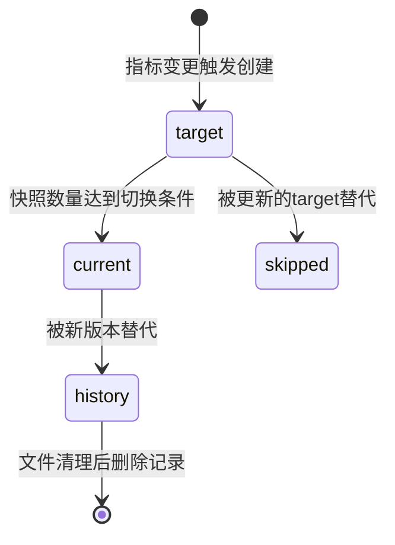
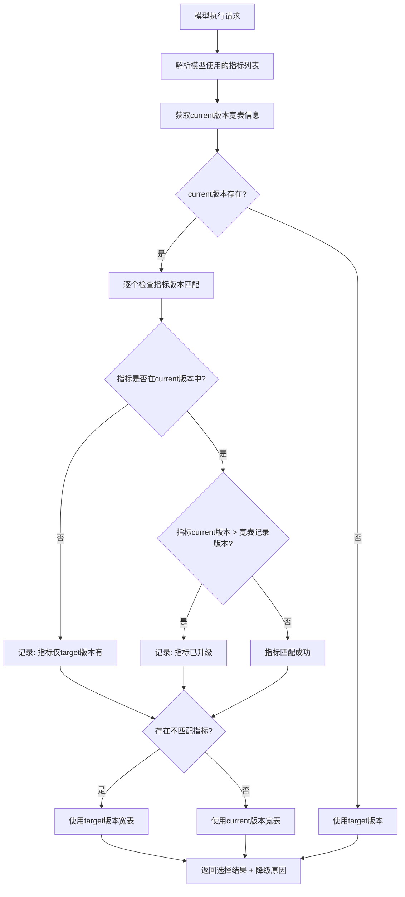
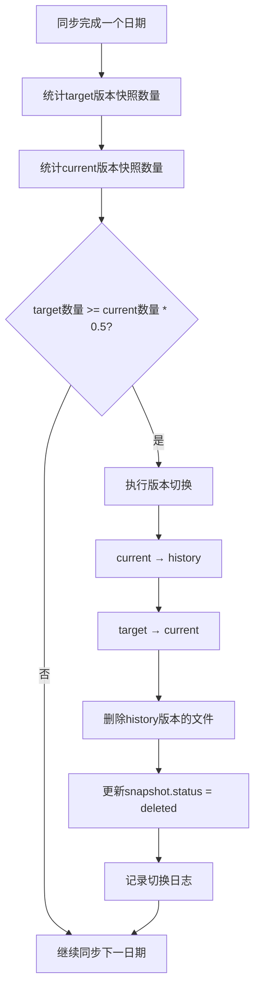
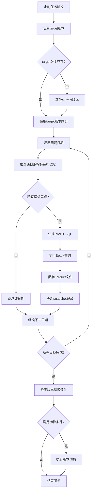

# 离线宽表主备版本改造技术方案

> **实现状态**: ✅ 已完成
> **最后更新**: 2024-12-10

## 1. 背景与目标

### 1.1 当前问题

当前系统采用单版本机制，当指标发生变更（上线/下线/版本升级）时：
- 必须等待新版本宽表完全同步完成后才能切换
- 在同步期间，如果使用了新指标的模型将无法执行
- 没有优雅的降级机制

### 1.2 改造目标

实现主备版本机制（current + target），提供：
1. **平滑过渡**：target版本逐步同步，不影响current版本使用
2. **智能降级**：基于指标版本匹配，自动选择最合适的宽表版本
3. **自动切换**：当target版本达到切换条件时自动提升为current
4. **自动清理**：切换时立即清理history版本的文件和记录

---

## 2. 版本状态设计

### 2.1 版本状态流转图



### 2.2 状态说明

| 状态 | 说明 | 快照文件 |
|------|------|----------|
| `target` | 正在同步中的目标版本，可能不完整 | 保留 |
| `current` | 当前正式使用的版本，唯一 | 保留 |
| `history` | 被替代的旧版本，等待清理 | 立即删除 |
| `skipped` | 未完成同步就被跳过的版本 | 无文件 |

---

## 3. 核心流程设计

### 3.1 宽表版本选择流程（模型执行时）



### 3.2 版本切换流程



### 3.3 宽表同步流程（调整后）



---

## 4. 数据模型变更

### 4.1 FraudHunterWideTableSnapshot 状态扩展

```python
# 当前状态: generating/ready/failed
# 新增状态: deleted

status: Mapped[str] = mapped_column(
    String(16),
    default='generating',
    nullable=False,
    comment='状态: generating/ready/failed/deleted'
)
```

### 4.2 新增降级日志表（可选）

```python
class FraudHunterVersionFallbackLog(Base):
    """版本降级日志表"""
    __tablename__ = "fraudhunter_version_fallback_log"
    
    id: Mapped[int] = mapped_column(primary_key=True)
    execution_id: Mapped[str] = mapped_column(String(64), comment='执行ID')
    model_code: Mapped[str] = mapped_column(String(64), comment='模型编码')
    wide_table_name: Mapped[str] = mapped_column(String(128), comment='宽表名称')
    etl_date: Mapped[date] = mapped_column(Date, comment='ETL日期')
    
    # 版本信息
    expected_version: Mapped[str] = mapped_column(String(64), comment='期望版本-current')
    actual_version: Mapped[str] = mapped_column(String(64), comment='实际版本-可能是target')
    
    # 降级原因
    fallback_reason: Mapped[str] = mapped_column(String(32), comment='降级原因类型')
    fallback_indicators: Mapped[dict] = mapped_column(JSON, comment='触发降级的指标详情')
    
    created_at: Mapped[datetime] = mapped_column(DateTime, default=datetime.now)
```

**降级原因类型（fallback_reason）**:
- `indicator_not_in_current`: 指标仅在target版本存在
- `indicator_version_upgraded`: 指标版本已升级，current版本记录的版本号落后
- `current_not_exist`: current版本不存在

---

## 5. 接口设计

### 5.1 版本选择服务接口

```python
class WideTableVersionSelector:
    """宽表版本选择器"""
    
    def select_version_for_model(
        self,
        db: Session,
        model: FraudHunterModelDefinition,
        wide_table_name: str,
        etl_date: date
    ) -> VersionSelectionResult:
        """
        为模型执行选择最合适的宽表版本
        
        Returns:
            VersionSelectionResult:
                - version_hash: 选中的版本hash
                - parquet_path: 文件路径
                - is_fallback: 是否降级
                - fallback_reason: 降级原因
                - mismatched_indicators: 不匹配的指标列表
        """
        pass
```

### 5.2 版本切换服务接口

```python
class WideTableVersionManager:
    
    def check_and_promote_target(
        self,
        wide_table_name: str
    ) -> Optional[FraudHunterWideTableVersion]:
        """
        检查target版本是否满足切换条件并执行切换
        
        切换条件: target快照数量 >= current快照数量 * 0.5
        
        Returns:
            切换后的current版本，如果未切换返回None
        """
        pass
    
    def cleanup_history_version(
        self,
        history_version: FraudHunterWideTableVersion
    ) -> int:
        """
        清理history版本的文件和记录
        
        Returns:
            删除的文件数量
        """
        pass
```

---

## 6. 详细实现方案

### 6.1 model_executor.py 改造

```python
def _get_parquet_path(
    self,
    db: Session,
    wide_table_name: str,
    etl_date: date,
    model_indicator_codes: List[str]  # 新增参数
) -> Tuple[Optional[str], VersionSelectionResult]:
    """
    获取指定日期的宽表parquet文件路径（支持智能降级）
    
    Args:
        db: 数据库会话
        wide_table_name: 宽表名称
        etl_date: ETL日期
        model_indicator_codes: 模型使用的指标编码列表
        
    Returns:
        (parquet_path, selection_result)
    """
    # 1. 获取current和target版本
    current_version = self._get_version_by_status(db, wide_table_name, 'current')
    target_version = self._get_version_by_status(db, wide_table_name, 'target')
    
    # 2. 如果没有current版本，直接使用target
    if not current_version:
        return self._get_target_parquet(db, target_version, etl_date, 'current_not_exist')
    
    # 3. 检查指标版本匹配
    mismatched_indicators = []
    for indicator_code in model_indicator_codes:
        mismatch = self._check_indicator_version_match(
            db, current_version, indicator_code
        )
        if mismatch:
            mismatched_indicators.append(mismatch)
    
    # 4. 如果存在不匹配，尝试使用target版本
    if mismatched_indicators:
        return self._try_fallback_to_target(
            db, current_version, target_version, etl_date, mismatched_indicators
        )
    
    # 5. 使用current版本
    return self._get_current_parquet(db, current_version, etl_date)

def _check_indicator_version_match(
    self,
    db: Session,
    current_version: FraudHunterWideTableVersion,
    indicator_code: str
) -> Optional[Dict]:
    """
    检查指标版本是否与宽表版本匹配
    
    Returns:
        不匹配信息，匹配则返回None
    """
    # 获取当前指标定义
    indicator = db.query(FraudHunterIndicatorDefinition).filter(
        FraudHunterIndicatorDefinition.indicator_code == indicator_code
    ).first()
    
    if not indicator:
        return None  # 指标不存在，跳过检查
    
    # 获取宽表版本中记录的指标版本
    metadata = current_version.indicator_metadata or {}
    
    # 遍历metadata查找指标
    indicator_in_version = None
    for ind_id, ind_meta in metadata.items():
        if ind_meta.get('indicator_code') == indicator_code:
            indicator_in_version = ind_meta
            break
    
    # 情况1：指标不在current版本中
    if not indicator_in_version:
        return {
            'indicator_code': indicator_code,
            'indicator_name': indicator.indicator_name,
            'reason': 'indicator_not_in_current',
            'message': f'指标 {indicator_code} 仅在target版本存在'
        }
    
    # 情况2：指标版本已升级
    version_in_wide_table = indicator_in_version.get('version', 0)
    if indicator.current_version > version_in_wide_table:
        return {
            'indicator_code': indicator_code,
            'indicator_name': indicator.indicator_name,
            'reason': 'indicator_version_upgraded',
            'message': f'指标 {indicator_code} 已升级: v{version_in_wide_table} -> v{indicator.current_version}',
            'old_version': version_in_wide_table,
            'new_version': indicator.current_version
        }
    
    return None  # 匹配成功
```

### 6.2 version_manager.py 改造

```python
def check_and_promote_target(
    self,
    wide_table_name: str
) -> Optional[FraudHunterWideTableVersion]:
    """检查并执行target→current版本切换"""
    
    # 1. 获取current和target版本
    current_version = self.db.query(FraudHunterWideTableVersion).filter(
        and_(
            FraudHunterWideTableVersion.wide_table_name == wide_table_name,
            FraudHunterWideTableVersion.status == 'current'
        )
    ).first()
    
    target_version = self.db.query(FraudHunterWideTableVersion).filter(
        and_(
            FraudHunterWideTableVersion.wide_table_name == wide_table_name,
            FraudHunterWideTableVersion.status == 'target'
        )
    ).first()
    
    if not target_version:
        return None
    
    # 2. 统计快照数量
    target_snapshot_count = self.db.query(FraudHunterWideTableSnapshot).filter(
        and_(
            FraudHunterWideTableSnapshot.version_hash == target_version.version_hash,
            FraudHunterWideTableSnapshot.status == 'ready'
        )
    ).count()
    
    current_snapshot_count = 0
    if current_version:
        current_snapshot_count = self.db.query(FraudHunterWideTableSnapshot).filter(
            and_(
                FraudHunterWideTableSnapshot.version_hash == current_version.version_hash,
                FraudHunterWideTableSnapshot.status == 'ready'
            )
        ).count()
    
    # 3. 检查切换条件: target >= current * 0.5
    # 如果没有current版本，只要target有一个快照就可以提升
    threshold = current_snapshot_count * 0.5 if current_version else 1
    
    if target_snapshot_count < threshold:
        logger.info(
            f"{wide_table_name} 未满足切换条件: "
            f"target={target_snapshot_count}, current={current_snapshot_count}, "
            f"需要>={threshold}"
        )
        return None
    
    # 4. 执行版本切换
    logger.info(
        f"开始版本切换: {wide_table_name}, "
        f"target({target_version.version_hash[:8]}) -> current"
    )
    
    # 4.1 current → history
    old_current = None
    if current_version:
        current_version.status = 'history'
        current_version.history_at = datetime.now()
        old_current = current_version
        logger.info(f"版本 {current_version.version_hash[:8]} -> history")
    
    # 4.2 target → current
    target_version.status = 'current'
    target_version.current_at = datetime.now()
    
    self.db.flush()
    
    # 4.3 清理history版本
    if old_current:
        self.cleanup_history_version(old_current)
    
    self.db.commit()
    
    logger.info(
        f"版本切换完成: {wide_table_name}, "
        f"新current={target_version.version_hash[:8]}"
    )
    
    return target_version

def cleanup_history_version(
    self,
    history_version: FraudHunterWideTableVersion
) -> int:
    """清理history版本的文件和记录"""
    
    # 1. 获取该版本的所有快照
    snapshots = self.db.query(FraudHunterWideTableSnapshot).filter(
        FraudHunterWideTableSnapshot.version_hash == history_version.version_hash
    ).all()
    
    deleted_count = 0
    
    for snapshot in snapshots:
        # 2. 删除物理文件
        if snapshot.parquet_file_path:
            try:
                file_path = Path(snapshot.parquet_file_path)
                if file_path.exists():
                    file_path.unlink()
                    deleted_count += 1
                    logger.info(f"删除文件: {file_path.name}")
            except Exception as e:
                logger.error(f"删除文件失败 {snapshot.parquet_file_path}: {e}")
        
        # 3. 更新快照状态为deleted
        snapshot.status = 'deleted'
    
    logger.info(
        f"清理版本 {history_version.version_hash[:8]} 完成, "
        f"删除 {deleted_count} 个文件"
    )
    
    return deleted_count
```

### 6.3 sync_service.py 改造

```python
def sync_multi_dates(
    self,
    wide_table_name: str,
    lookback_days: int
) -> Dict:
    """批量同步多个日期的宽表（支持自动版本切换）"""
    
    # ... 现有同步逻辑 ...
    
    # 同步完成后，检查版本切换条件
    with get_db_session() as db:
        version_manager = WideTableVersionManager(db)
        promoted_version = version_manager.check_and_promote_target(wide_table_name)
        
        if promoted_version:
            result['version_promoted'] = True
            result['new_current_version'] = promoted_version.version_hash[:8]
            logger.info(f"版本已自动切换: {promoted_version.version_hash[:8]}")
    
    return result
```

---

## 7. 切换条件说明

### 7.1 为什么是 0.5（50%）？

选择50%作为切换阈值的考虑：
1. **平衡及时性和稳定性**：不需要等待100%同步完成，可以更快地使用新版本
2. **覆盖主要使用场景**：大多数模型回测只需要近期几天的数据
3. **可配置**：可以通过配置参数调整

### 7.2 边界情况处理

| 场景 | 处理方式 |
|------|----------|
| current不存在，target有1个快照 | 允许切换（首次创建） |
| current有10个快照，target有4个 | 不切换（4 < 10*0.5） |
| current有10个快照，target有5个 | 允许切换（5 >= 10*0.5） |
| target没有ready的快照 | 不切换 |

---

## 8. 降级提示信息设计

### 8.1 日志格式

```
[版本降级提示] 模型 MODEL_001 在 2024-01-15 使用了target版本宽表
降级原因:
- 指标 i_dep_acct_001 仅在target版本存在（新上线指标）
- 指标 i_dep_acct_002 已升级: v1 -> v2（指标逻辑变更）

建议: 等待target版本宽表同步完成后会自动切换为current版本
```

### 8.2 返回结果结构

```python
@dataclass
class VersionSelectionResult:
    """版本选择结果"""
    version_hash: str                    # 选中的版本
    parquet_path: str                    # 文件路径
    is_fallback: bool                    # 是否降级
    fallback_reason: Optional[str]       # 降级原因类型
    mismatched_indicators: List[Dict]    # 不匹配指标详情
    message: str                         # 用户友好的提示信息
```

---

## 9. 实现计划

### 阶段一：数据模型和基础设施（1天）
- [ ] 修改 [`FraudHunterWideTableSnapshot`](backend/models/fraudhunter/wide_table.py:155) 增加 `deleted` 状态
- [ ] 新增 `FraudHunterVersionFallbackLog` 降级日志表（可选）
- [ ] 编写数据库迁移脚本

### 阶段二：版本管理改造（1天）
- [ ] [`version_manager.py`](backend/services/fraudhunter/wide_table_service/version_manager.py:1) 新增 `check_and_promote_target()` 方法
- [ ] [`version_manager.py`](backend/services/fraudhunter/wide_table_service/version_manager.py:1) 新增 `cleanup_history_version()` 方法
- [ ] 单元测试

### 阶段三：同步服务改造（0.5天）
- [ ] [`sync_service.py`](backend/services/fraudhunter/wide_table_service/sync_service.py:1) 集成版本切换检查
- [ ] 调整同步完成后的后处理逻辑
- [ ] 单元测试

### 阶段四：模型执行器改造（1.5天）
- [ ] [`model_executor.py`](backend/services/fraudhunter/model_service/model_executor.py:1) 实现 `_check_indicator_version_match()` 方法
- [ ] 改造 `_get_parquet_path()` 支持智能降级
- [ ] 实现降级日志记录
- [ ] 集成测试

### 阶段五：集成测试和文档（0.5天）
- [ ] 端到端测试
- [ ] 更新API文档
- [ ] 编写运维手册

---

## 10. 风险评估

| 风险 | 影响 | 缓解措施 |
|------|------|----------|
| 版本切换时删除文件失败 | 磁盘空间浪费 | 增加重试机制，定期清理任务 |
| 降级到target但target无数据 | 模型执行失败 | 提前检查target快照是否存在 |
| 并发同步导致状态不一致 | 数据异常 | 使用数据库事务保证原子性 |
| 切换阈值不合理 | 过早/过晚切换 | 支持配置化，可根据实际情况调整 |

---

## 11. 配置项

```yaml
# config.yaml
fraudhunter:
  wide_table:
    # 版本切换阈值（target快照数量 / current快照数量）
    version_promote_threshold: 0.5
    # 是否启用自动版本切换
    auto_promote_enabled: true
    # 是否记录降级日志到数据库
    fallback_log_enabled: true